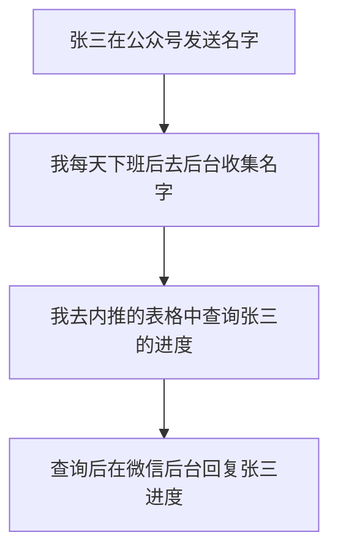
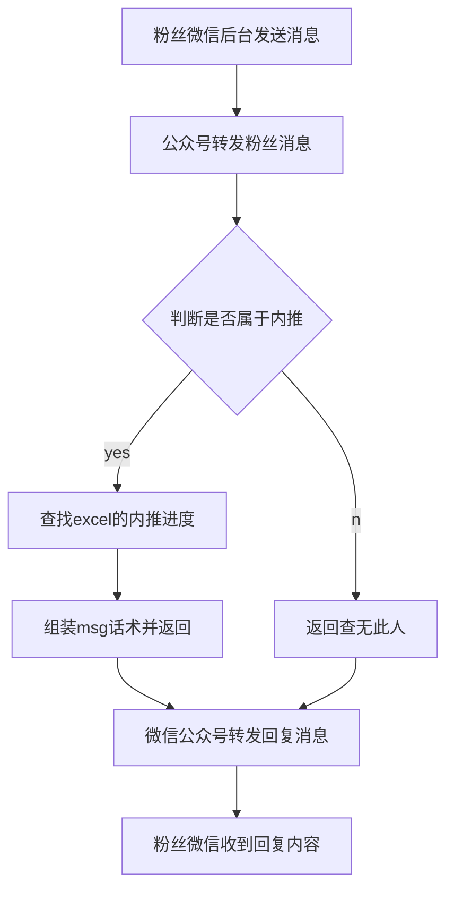
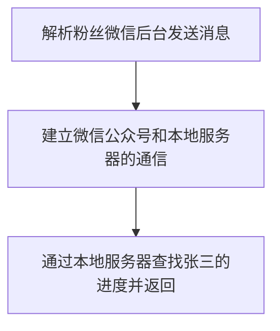

# 每天上百条私信，我是如何自动发送校招内推进度的....

## 项目背景

最近帮很多同学进行内推，作为一个有责任心的人，必须要全程帮大家查询内推的投递进度。

毕竟之前把牛都吹出去了...


因此目前的查询流程是



这种淳朴（弱智）的查询方式存在有很多问题。

- **投递的同学无法及时获得反馈。**经常有人连续私信好几条没有回复，误以为是不是私信的格式不对...
- 私信积攒过多，我也容易眼花，依靠**人工很容易出差错。**
- 即使每天统一回复一次，几十甚至上百条的私信也**耽误了我大量的休息时间。**

毕竟身为一个程序员，那么我能不能通过自动回复的方式，帮助我自动查询投递进度并发送给你呢？

## 需求分析

- 粉丝能够**即时自动**的查询航旅校招内推的进度。
- 成本足够低，最好免费。（毕竟内推费一分钱没到手，总不能让我还往里搭钱吧！）

先画一个业务的流程图



是不是看起来还挺简单，既然明确了需求，说干就干！那么我们如何进行技术实现呢？

## 技术实现

将业务流程拆解成技术实现，其实主要分三个步骤。



首先面向百度编程，找到最简单的就是通过图灵机器人来调用api，轻松的实现智能聊天。但最便宜的版本19.9/月....好吧，直接劝退。

去github和gitee上找找也没有找到开箱可用的工具。

那就只能启动我尘封的ide，进行自己开发啦！

### 1.微信后台私信收到消息

这个很简单，微信提供了官方的api，直接监听私信收到的消息即可。

### 2.建立微信公众号和本地服务器的通信

#### 2.1、创建本地web服务器

既然是做程序开发，就要给程序一个家（服务器）。不过咱既然秉持降本提效的原则，绝不可能花钱买云服务器。那么可不可以把我的电脑当成一个服务器来进行本地开发？当然可以！

我们先创建一个本地服务器。选择一个你熟悉的技术框架启动一个web服务。

> 我这里用的是python的flask，当然springboot啥的也都没问题，这里不多介绍，可以直接百度如何创建一个最简单的web服务。

启动flask之后，又到了经典的hello world环节。


但我们此时搭建的本地服务器是内网环境，只能供我们电脑的浏览器或同一个wifi的手机访问，那如何让别人通过外网能访问到本地服务器呢？这就需要做**内网穿透**，其实也就是反向代理。

内网穿透的姿势有很多，本着降本提效的原则，自然是选择简单又免费的natapp。

#### 2.2、内网穿透

##### 2.2.1、创建隧道

进入官网 [NATAPP官网](https://natapp.cn/)，先注册一个NATAPP账号，用来创建隧道。


接下来进行隧道配置

本地地址:默认127.0.0.1

本地端口:和web服务器启动的端口保持一致我这里是5000

authtoken:保存下来后面用。


##### 2.2.2、下载NATAPP客户端

官网右上角，按照你的系统下载一个客户端。我选择了Mac OS X 64位，下载后解压到任意目录。

##### 2.2.3、运行NATAPP

在natapp的同级目录下创建 config.ini文件。

```
[default]
authtoken=1659b9dad1633 //这里填你的隧道号 authtoken
clienttoken=
log=none                        
loglevel=ERROR                  
http_proxy=  
```

在Linux/MAC下 需要先给执行权限

```
chmod a+x natapp
```

然后执行运行

```
./natapp
```

出现如下界面表示启动成功，natapp会随机分配给你一个域名，外网访问这个域名就可以映射到你本机对应的端口。


至此，已经完成了内网的穿透，现在点击http的链接即可访问到我们本地的web服务啦！

#### 2.3、配置微信公众号后台建立通信

首先咱得有个公众号吧，在公众号后台开启「开发者模式」。

设置与开发-基本配置-修改服务器配置。

URL：使用内网穿透的url。

Token：自己随便写一串数字或者字母。

EncodingAESKey：直接点随机生成。


点击提交，显示提交成功。

至此，我们**通过flask启动了一个web服务器**，并**通过NATAPP做内网穿透**，最后通过配置建立了**微信后台和本地服务器的连接**。环境调通，终于到了紧张刺激的写代码环节。

### 3.通过本地服务器查找内推进度

代码的总体逻辑很简单，接收微信公众号发过来的姓名信息，我们对姓名信息进行解析处理。查询该姓名是否在本地excel中，如果在给粉丝return校招进度。

通过查看微信公众号的开发手册，可以了解到信息处理流程。


这样就将微信公众号后台和本地web服务器建立链接了。我们再把收到的xml进行解析，提取出Content信息，通过content可以去excel进行查找和给粉丝回复请求。全部代码如下：

app.py

```python
# -*- coding:utf-8 -*-
from flask import Flask
from flask import request
import time
import SelectStudent
import xml.etree.ElementTree as ET
import hashlib
app = Flask(__name__)
@app.route("/")
def index():
    return "Hello World!"
@app.route("/wechat", methods=["GET","POST"])
def weixin():
    if request.method == "GET":     # 判断请求方式是GET请求
        my_signature = request.args.get('signature')     # 获取携带的signature参数
        my_timestamp = request.args.get('timestamp')     # 获取携带的timestamp参数
        my_nonce = request.args.get('nonce')        # 获取携带的nonce参数
        my_echostr = request.args.get('echostr')         # 获取携带的echostr参数
        token = "123456789"  # 一定要跟刚刚微信开发者设置中填写的token一致
        # 进行字典排序
        data = [token, my_timestamp, my_nonce]
        data.sort()
        # 拼接成字符串，进行hash加密时需要为字符串类型
        temp = ''.join(data)
        # 创建一个hash对象
        s = hashlib.sha1()
        # 对创建的hash对象更新需要加密的字符串
        s.update(temp.encode("utf-8"))
        # 加密处理
        mysignature = s.hexdigest()
        print("handle/GET func: mysignature, my_signature: ", mysignature, my_signature)
        # 加密后的字符串可与signature对比，标识该请求来源于微信
        if my_signature == mysignature:
            return my_echostr
        else:
            return ""
    else:
        # 解析xml
        xml = ET.fromstring(request.data)
        toUser = xml.find('ToUserName').text
        fromUser = xml.find('FromUserName').text
        msgType = xml.find("MsgType").text
        createTime = xml.find("CreateTime")
        # 判断类型并回复
        if msgType == "text":
            content = xml.find('Content').text
            print("content=",content)
            return reply_text(fromUser, toUser, SelectStudent.excel_reply(content))
        else:
            return reply_text(fromUser, toUser, "李梨同学目前只能接收文字哦")
        pass
def reply_text(to_user, from_user, content):
    """
    以文本类型的方式回复请求
    """
    return """
    <xml>
        <ToUserName><![CDATA[{}]]></ToUserName>
        <FromUserName><![CDATA[{}]]></FromUserName>
        <CreateTime>{}</CreateTime>
        <MsgType><![CDATA[text]]></MsgType>
        <Content><![CDATA[{}]]></Content>
    </xml>
    """.format(to_user, from_user, int(time.time() * 1000), content)
if __name__ == "__main__":
    app.run(host='0.0.0.0', port=80)
```

还要写一段查找excel的逻辑，主逻辑非常简单，就不画流程图了。

- 判断「张三」是否在表格中。
- 判断「张三」的简历状态。
- 根据简历状态，拼接文案给粉丝回复。

SelectStudent.py

```python
import pandas as pd
def excel_reply(name):
    """关键字回复"""
    df = pd.read_excel('static/candidates2023.xlsx')
    df = df.applymap(lambda x: str(x).strip())#去除表格中的空格
    df_data = df[['候选人姓名', '简历筛选状态']]
    # 判断名字是否在内推的名单中
    if name in df["候选人姓名"].values:
        print("查找的候选人存在")
        # 通过名字查询候选人信息
        candidates = df[df_data["候选人姓名"] == name]
        if candidates['简历筛选状态'].values == "未通过":
            msg = name + "您好，您当前在航旅纵横校招内推的进度为未通过简历筛选，后续依然有招聘机会，期待您的继续关注！"
            return msg
        if candidates['简历筛选状态'].values == "通过":
            msg = name + "您好，您当前在航旅纵横校招内推的进度为通过简历筛选，请等待后续的流程通知！"
            return msg
        if candidates['简历筛选状态'].values == "已发送，待筛选":
            msg = name + "您好，您当前在航旅纵横校招内推的进度为正在业务部门进行筛选，请耐心等待！"
            return msg
        else:
            msg = "您查找的候选人" + name + "不存在，请确认" + name + "是否内推成功。\nPS:李梨同学目前只支持通过姓名查询哦！"
            return msg
    else:
        msg = "您查找的候选人"+name+"不存在，请确认"+name+"是否内推成功。\nPS:李梨同学目前只支持通过姓名查询哦！"
        return msg
```

我们进入微信对话框进行测试。


大功告成！开心撒花！

## TODO

- 当前服务部署在本地服务器，当电脑断网关机会导致服务不可用。有空研究下微信云托管来保障服务的稳定性。
- 接收到长字符串无法处理，系统异常报错。需要增加系统的健壮性。
- 同名候选人无法处理，直接抛异常。需要做去重处理或增加联合查询。