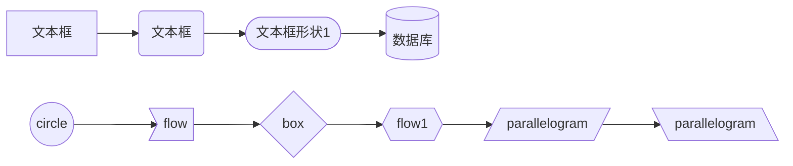
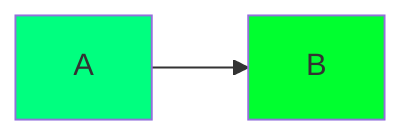
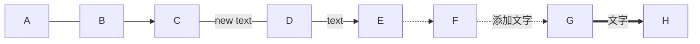
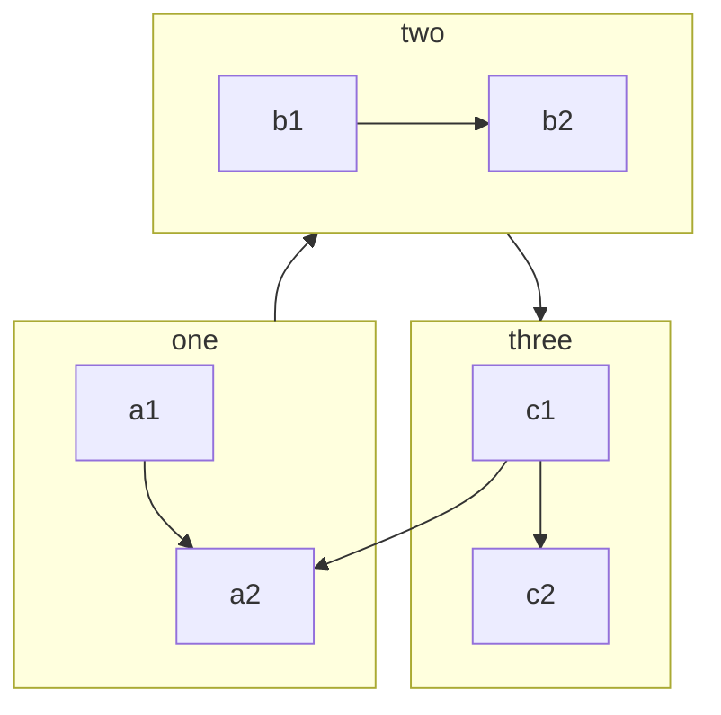
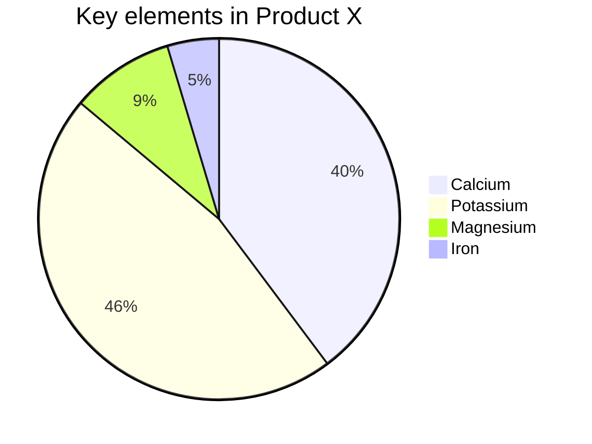

# Typora(meimaid)绘制流程图

# 0、说在前面

在写文档时难免需要画画流程图，主流的画图工具如processon等工具需要登陆or付费不说，每当修改的时候还需要重新编辑再重新导出，就非常的麻烦。那么能不能通过Markdown文字的方式，随便写写就能画好一张图呢！这就是meimaid！

> *Typora编辑时输入flow即可，CSDN在编辑时关键字flow会被自动转换成mermaid语法flowchat，所以代码首行会显示flowchat。

# 1、如何使用

先在 Typora 中，输入 **```mermaid** 然后敲击回车，即可初始化一张空白图。

## 流程图

### 节点特效



### 节点颜色

> 可通过颜色选择工具获取颜色代码https://photokit.com/colors/?lang=zh



### 连接线



### 子图



### 流程图方向

| 代码 | 含义          |
| ---- | ------------- |
| TB   | Top to Down   |
| TD   | Top Down =TB  |
| BT   | Bottom to Top |
| RL   | Right to Left |
| LR   | Left to Right |

## 饼图

饼图使用 `pie` 表示，标题下面分别是区域名称及其百分比。



# 2、导出图片

Mermaid 官方有一个在线的工具，可以导出 SVG 和 PNG。

[Mermaid 官方在线工具](https://mermaid-js.github.io/mermaid-live-editor)


drawio开源免费的在线流程图

https://www.diagrams.net/