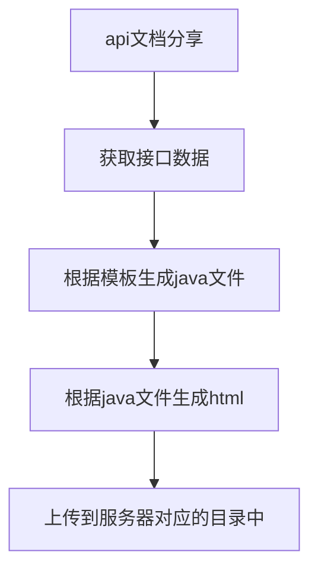

## apidoc自动生成接口文档

> 本文以接口文档分享的需求为契机，讲述对apidoc技术的应用与源码的改动。

## 需求分析

- 在umeapi接口管理平台增加接口文档的功能。（读取平台上的数据，便于用户分享）
  - 单接口分享
  - 整个工程接口分享
- 文档可以进行对历史版本进行对比。
- 请求和响应的参数增加mock值等等

## 技术选型方案

- Swagger：可以导出api的json格式，强依赖Java项目运行，不支持离线文档功能
- knife4j：根据标准规范，生成的在线markdown离线文档，开发者可以进行拷贝生成markdown接口文档，通过其他第三方markdown转换工具转换成html或pdf
- YApi：支持常用的接口管理功能，提供了权限管理、Mock数据、Swagger数据导入和API接口导出静态文本格式，在线接口测试和切换配置环境
- **APIDOC：提供IDEA和VS code插件，支持大部分开发语言，跨平台，很方便扩展；支持多个不同语言的多个项目生成一份文档；输出模板可自定义；根据文档生成 mock 数据；**

> 综上分析对比，**APIDOC对业务代码无侵入、无需运行java代码即可生成文档、模板自定义、页面美观**，故选择APIDOC技术实现。

## 技术实现

### springboot使用apidoc

> apidoc是基于注释来生成文档的，它不基于任何框架，而且支持大多数编程语言。

1、安装node.js环境，不做介绍，网上有很多。

2、指定apidoc版本的安装。（也可以安装最新版，但我新版遇到了问题降版本解决的。）

```apl
npm install apidoc@0.28.1 -g
```

只需要一条apidoc就已经安装完成了，安装的目录在你node_modules中。（我的路径`/usr/local/lib/node_modules/apidoc/`

> 默认全局安装，如果想安装到项目中，这样可以在另一个环境下,`npm install`就可以下载有所有依赖包
>
> npm install apidoc --save-dev/-D

3、测试一个demo

随便写个函数，上面加个注释。

```java
public class ApiDocDemo {
/**
* @apiVersion 1.0.0
* @api {post}{POST} /register 注册用户
* @apiGroup User
* @apiDescription 注册用户
* @apiSampleRequest off
* @apiParam (请求参数) {String} account 用户账户名
* @apiSuccess (响应数据) {String} msg 信息
*
*/
public void doc() {
return doc();
}
}
```

4、根目录配置apidoc.json文件

```json
{
  "name": "apidoc-demo", 
  "version": "1.0.0",
  "description": "",
  "main": "index.js",
  "author": "Eve",
  "license": "MIT",
  "apidoc": { 
    "name": "UmeApi接口文档demo", //文档名称
    "description": "You write something here to describe your project", //文档描述
    "title": "The title of this doc", // 形成的浏览器页面标题
    "url": "http://", //api的前缀路径
    "sampleUrl": "http://localhost:3300", // 页面测试api请求的url前缀，会覆盖useHostUrlAsSampleUrl - 这个配置项不设置的话，内部的@apiSampleRequest设置也不起作用
    
    //api-name排序或者group-name排序, 先进行group排序-再进行name排序, 没有的则自动在后面显示
    "order":[
    ],
    "template": {
    "forceLanguage": "zh_cn",// 生成apidoc的默认语言，默认zh_cn（中文简体）
    "withCompare": true,// 是否需要进行版本对比，默认true
    "withGenerator": true,// 是否需要显示编译信息（主要是编译日期和apidoc版本），默认true
    "aloneDisplay": false // 是否需要单独显示某个api，默认false
    }
  }
}
```

5、生成文档。

```
apidoc -i apisrc/ -o apidoc/
```

> -i 输入目录 -o 输出目录
>
> apisrc是ApiDocDemo代码所在目录
>
> apidoc是网页文件的输出目录。

apidoc中会出现这样的一些文件，打开index.html就有你生成的文档了


至此一个简单的demo就完成了，证明本方案可行。

那么系统中成千上万的接口，我总不能手动去写注释吧？**那么有没有一种模板，可以动态传参数并生成java文件呢？**

### freemarker生成模板文件

**FreeMarker** 是一款 模板引擎： 即一种基于模板和要改变的数据， 并用来生成输出文本(HTML网页，电子邮件，配置文件，源代码等)的通用工具。 是一个Java类库。

1、增加pom依赖

```java
<!-- 引入freemarker模板引擎的依赖 -->
<dependency>
    <groupId>org.springframework.boot</groupId>
    <artifactId>spring-boot-starter-freemarker</artifactId>
</dependency>
```

2、配置application.properties

```java
# 是否开启thymeleaf缓存,本地为false，生产建议为true
spring.freemarker.cache=false
spring.freemarker.charset=UTF-8
spring.freemarker.allow-request-override=false
spring.freemarker.check-template-location=true
    
#类型
spring.freemarker.content-type=text/html
spring.freemarker.expose-request-attributes=true
spring.freemarker.expose-session-attributes=true
    
#文件后缀
spring.freemarker.suffix=.ftl
#路径
spring.freemarker.template-loader-path=classpath:/templates/
```

3、定义模板文件

test.ftl

```html
package com.taobao.rigel.rap.controller;
import java.util.Map;
public class ApiDocDemo {
/**
* @apiVersion ${apiVersion}
* @api {${method}} ${url} ${title}
* @apiGroup ${group}
* @apiDescription ${description}
* @apiSampleRequest off
<#list apiParamsList as apiParam>
    * @apiParam (请求参数) {${apiParam.type}} ${apiParam.field}=${apiParam.mock} ${apiParam.description}
</#list>
*
<#list apiSuccessList as apiSuccess>
    * @apiSuccess (响应数据) {${apiSuccess.type}} ${apiSuccess.field}=${apiSuccess.mock} ${apiSuccess.description}
</#list>
*
*/
public void doc() {
return doc();
}
}
```

4、编写路由ApiDocController.java 

> 重点代码已隐藏，只展示测试类的处理step,其实原理就是按照test.ftl的关键字将值来put到dataMap中，最后通过template.process将dataMap输出到out目录中。
>
> 一个java文件，代表着一个接口，我这里采用时间戳的方式对每一个生成的java文件进行区分。

```java
    @RequestMapping(value = "/shareApiDoc", method = RequestMethod.GET)
    public Map<String, Object> shareApiDoc(@RequestParam(value = "actionId") int actionId) {

        // step1 创建freeMarker配置实例
        Configuration configuration = new Configuration();
        Writer out = null;
        try {
            // step2 获取模版路径
            configuration.setDirectoryForTemplateLoading(new File(TEMPLATE_PATH));
            // step3 创建数据模型
            Map<String, Object> dataMap = new HashMap<String, Object>();
            //assemble apidoc base info
            dataMap.put("apiVersion", apiVersion);
            dataMap.put("method", requestType);
            dataMap.put("url", actionInfo.getRequestUrl());
            dataMap.put("title", actionInfo.getName());
            dataMap.put("group", page.getName());
            dataMap.put("description", actionInfo.getDescription());
            //get apiParamsList
            List<ApiParam> apiParams = new ArrayList<>();
            dataMap.put("apiParamsList", apiParams);
            //get apiSuccessList
            List<ApiParam> apiSuccess = new ArrayList<>();
            dataMap.put("apiSuccessList", apiSuccess);
            // step4 加载模版文件
            Template template = configuration.getTemplate("test.ftl");
            // step5 生成数据 output to apisrc directory
            File docFile = new File(fileSrc.getPath() + "/" + actionInfo.getName() + nowTime + ".java");
            out = new BufferedWriter(new OutputStreamWriter(new FileOutputStream(docFile)));
            template.process(dataMap, out);
        } catch (Exception e) {
            e.printStackTrace();
        } finally {
            try {
                if (null != out) {
                    out.flush();
                }
            } catch (Exception e2) {
                e2.printStackTrace();
            }
        }
        return null;
    }
```

### apidoc文档分享实施方案

在实现之前首先对umeapi平台进行分析，对于接口的信息主要分为3部分。

- 接口的基本信息：如接口名称、接口请求类型、接口描述、版本号等等。
- 请求参数：变量名、备注、类型、mock数据、是否必须。
- 响应参数：变量名、备注、类型、mock数据、是否必须。

> 因此需要生成文档的三部分

- 接口基本信息
  - `@api {type} path [title]` 定义api路径，以及形成左侧菜单的名称
  - `@apiVersion version` 定义api版本 version-版本号
  - `@apiDescription text` 定义api描述信息
  - `@apiGroup name` 定义api分组名称
  - `@apiSampleRequest url` off 调整示例请求的url，off代表关闭调试功能
- 请求参数
  - `@apiParam [(group)] [{type}] [field=defaultValue] [description]` 定义参数-可以分组
- 响应参数
  - `@apiSuccess [(group)] [{type}] field [description]` 定义返回的数据 `用法同@apiParam`

> 这些是我所需要的参数，其他的更多参数放在文末。

resources新增目录结构

- apidoc
  - projectId
    - actionName+时间戳
- outputdoc
  - projectId
    - 生成的文件
- template
  - 存放模板文件
- footer.md
- header.md





## 遇到问题及解决办法

### 1、umeapi数据与apidoc规则不兼容。

**问题描述：**

在请求和响应的字段中，apidoc默认字段名称为数字或英文。

但由于umeapi的接口使用不规范，很多都是中文字段名，因此导致生成文档时报错。

```
{"Block":3,"Element":"@apiSuccess","File":"app/routes/user.js","Source":"@apiSuccess {String}   错误提示","level":"error","message":"Empty parser result."}
```

**解决办法：**

读源码发现apidoc-core使用的是正则匹配的方式进行校验匹配，

修改源码node_modules/apidoc-core/lib/parsers/api_param.js

regExp下增加中文字符的匹配。

```
\u4e00-\u9fa5
```


至此，解决了字段名称不能为中文的问题。


参考资料：

- 正则匹配教程https://www.runoob.com/regexp/regexp-tutorial.html
- 正则匹配测试https://regexr.com/
- [如何教你看懂复杂的正则表达式](https://www.cnblogs.com/superstar/p/6638970.html)

### 2、存在不同的接口但是url相同，这个如何处理？

会粘连，无法导航。可能需要前端来配合。

- 影响范围：不影响单接口文档，影响工程下的所有文档，

实现方案：在前端js中修改name名称。

```js
  // grouped by group and name
  var apiByGroupAndName = {};
  let entryName = new Set([]);
  var i=0;
  $.each(apiByGroup, function (index, entries) {
    apiByGroupAndName[index] = _.groupBy(entries, function (entry) {
        i++;
        if(entryName.has(entry.name)){
          
            entry.name=entry.name+i;
            entryName.add(entry.name);
        }
        entryName.add(entry.name);
      return entry.name;
    });
  });
```

完美解决！！

> 可通过设置`@apiName name` 定义api名称，因为名称基本都不同，所以可解决粘连的问题。

### 3、{Map[String, String]}类型无法兼容

修改源码：使得任何字符都可以匹配。

```js
        type:                '([a-zA-Z0-9\(\)#:\\.\\/\\\\\\[\\]_\|-]+)', // 2
        type:                '(.+?)', // 2
```


### 4、发送示例请求无法关闭

一定要在配置中设置sampleUrl,否则注释中的@apiSampleRequest就不会生效，即使关闭了也不会生效。


之后设置为off即可关闭。

```
* @apiSampleRequest off
```


## 其他

### apidoc 更多命令参数列表

|         参数         | 描述                                                         |
| :------------------: | ------------------------------------------------------------ |
|      -h, --help      | 查看帮助文档                                                 |
|  -f --file-filters   | 指定读取文件的文件名过滤正则表达式(可指定多个) 例如: `apidoc -f ".*\\.js$" -f ".*\\.ts$"` 意为只读取后缀名为js和ts的文件 默认值:`.clj .cls .coffee .cpp .cs .dart .erl .exs?`  `.go .groovy .ino? .java .js .jsx .kt .litcoffee lua .p .php? .pl .pm .py .rb .scala .ts .vue` |
| -e --exclude-filters | 指定不读取的文件名过滤正则表达式(可指定多个) 例如:`apidoc -e ".*\\.js$"` 意为不读取后缀名为js的文件 默认:`''` |
|     -i, --input      | 指定读取源文件的目录 例如：`apidoc -i myapp/` 意为读取`myapp/`目录下面的源文件 默认值:`./` |
|     -o, --output     | 指定输出文档的目录 例如：`apidoc -o doc/` 意为输出文档到`doc`目录下 默认值:`./doc/` |
|    -t, --template    | 指定输出的模板文件 例如:`apidoc -t mytemplate/` 默认:`path.join(__dirname, '../template/')(使用默认模板)` |
|     -c, --config     | 指定包含配置文件(apidoc.json)的目录 例如:`apidoc -c config/` 默认:`./` |
|    -p, --private     | 输出的文档中是否包含私有api 例如:`apidoc -p true`  默认:`false` |
|    -v, --verbose     | 是否输出详细的debug信息 例如:`apidoc -v true` 默认:`false`   |

### **apidoc.json配置项**

|      参数       | 描述                                                         |
| :-------------: | ------------------------------------------------------------ |
|      name       | 工程名称 如果`apidoc.json`文件中没有配置该参数，`apidoc`会尝试从`pakcage.json`文件中读取 |
|     version     | 版本 如果`apidoc.json`文件中没有配置该参数，`apidoc`会尝试从`pakcage.json`文件中读取 |
|   description   | 工程描述 如果`apidoc.json`文件中没有配置该参数，`apidoc`会尝试从`pakcage.json`文件中读取 |
|      title      | 浏览器标题                                                   |
|       url       | api路径前缀 例如:`https://api.github.com/v1`                 |
|    sampleUrl    | 如果设置了该参数，那么在文档中便可以看到用于测试接口的一个表单(详情可以查看参数@apiSampleReques) |
|  header.title   | 页眉导航标题                                                 |
| header.filename | 页眉文件名(markdown)                                         |
|  footer.title   | 页脚导航标题                                                 |
| footer.filename | 页脚文件名(markdown)                                         |
|      order      | 接口名称或接口组名称的排序列表 如果未定义，那么所有名称会自动排序 "order":[      "Error",     "Define",    "PostTitleAndError",    "PostError" ] |

## 参考文档：

- 通过apidoc工具自动生成：https://apidocjs.com/ https://apidoc.tools/#usage

- 【ApiDoc】官方文档(翻译)：https://www.jianshu.com/p/9353d5cc1ef8
- 使用apiDoc书写API文档规范https://www.jianshu.com/p/079a1c7ae1f2
- 模板美化：https://github.com/ahmed-dinar/apidoc-template
- https://juejin.cn/post/6844903871865847821
- nginx：https://www.yisu.com/zixun/585592.html

## 说在后面：

虽然用apidoc可以满足我们目前的需求，但总存在诸多不便。如：

- 框架束缚太严重，改动源码成本太高。
- 文档的模板较为固定，难以对文档做自定义的保存。
- 由于数据的规范问题，对个别接口字段的数据读取有误，难以数据保证100%的准确性。

因此又研究了一下基于markdown文档的docsify的技术。下篇文章介绍下这个更优雅的文档方案。
