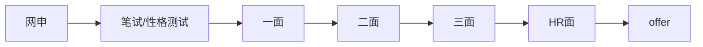
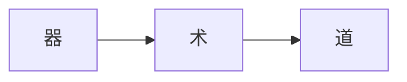
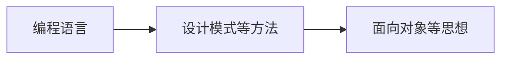
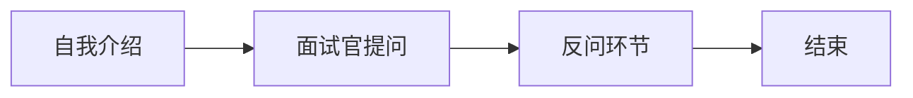

# **吊打面试官系列课程**

# 课程简介

自我介绍：

- 面试几百次：开发/测试/算法/数分/产品。
- offer几十家：国企/央企/事业单位。

互联网：滴滴ssp、网易ssp、阿里sp、大疆sp、百度、京东sp、小米sp等

国央企：航旅纵横、中国移动、中国联通、中国电信、网联清算、中芯国际、北京银行、光大银行、人保科技、神舟软件等

事业单位：中国人民银行、国家信息中心、中国信通院、中科院、中电科、七院环佳。

## 说在前面

> 背景：为什么要做这件事情？
>
> 「发心」：如果通过我的所知所学，能对其他人有所帮助，那将是我个人莫大的荣幸。
>
> 本来就想做点自媒体相关的内容，系统的对校招进行梳理。
>
> 商业变现模式：**课程全部免费**+增值服务收费。
>
> 增值服务：定制化修改简历、模拟面试+复盘、职业选择与规划等。

**23校招的挑战（难！）**

- 「人多」：疫情后扩招元年。
- 「坑少」：全球经济低迷，互联网hc大幅缩减。
- 「养鱼」：很多企业在等大事发生。

事已至此，~~先吃饭吧！~~ **得做点啥！**

- 拒绝海投，精细化投递，针对岗位定制简历。
- 多刷面经，模拟面试，让面试像呼吸一样自然。
- 做最坏的打算，时刻养鱼，Always Day One!

PS:校招污点名单[School-Admissions-Tainted](https://github.com/outman-lili/School-Admissions-Tainted)

## 课程目录

1. 网申：你是海王，还是舔狗？如何写好你的简历？
2. 综合面：逢面必问，大同小异。自我介绍如何讲？结束之前问点啥？
3. ~~技术面：善于引导，掌控节奏。每轮面试到底有啥区别？~~
4. hr面：输出观点，多讲故事。如何让hr虎躯一震？
5. offer：顶级拉扯，反复横跳。如何跟公司要到更多的薪水？
6. 选择：多方权衡，全局最优。如何对比选择出合适的offer?
7. 番外篇：花式内卷，佛系躺平。互联网和国企的差异？

## 课程特点

授人以鱼不如授人以渔。理解面试的原理，掌握方法和技巧，不背答案。提高面试的成功概率，让面试像呼吸一样自然！

方法论（原理）+实际操作（运用）+模拟面试（实践）

## 面向对象

求职意向为互联网、国央企和事业单位的校招生。

## 明确个人需求

- 岗位
- 行业
- 城市
- 薪资

# 秋招的完整流程

## 1、网申环节（第一次直播）

明确需求：岗位/行业/薪资/城市。

### 1.1、简历

为什么你明明学校学历都很好，简历却依然会被挂掉？

> 我连夜看了500份简历，终于研究出通过筛选的秘密.....

最近帮很多同学进行内推，先恭喜通过筛选的同学进入面试，也对在简历筛选挂掉的同学表示遗憾。但在这其中，有些同学明明学校学历很好（985/211硕士），实习经历也很丰富（多段大厂实习），但却依然被第一轮的筛选挂掉？我实在是为这些同学感到惋惜！

于是我熬夜看了几百份简历，发现通过筛选的简历，需要做好这三件事儿！

对于筛选简历，不同HR的做法可能不同，但原则还是要**「人岗匹配」。**

那么什么是一份好的简历？如何能写好一份和岗位匹配的简历？

先看一下简历的定义。

> 简历（resume），顾名思义，就是对个人学历、经历、特长、爱好及其它有关情况所作的简明扼要的书面介绍。简历是有针对性的自我介绍的一种规范化、逻辑化的书面表达。--来源百度百科。

简历不仅仅是hr和面试官对你的第一印象，更是个人总结和表达能力的一个体现。

> 试想如果一个简历都写的乱七八糟，那工作后的需求/技术文档、工作总结就能写好了吗？

好的简历：

- 布局干净整洁，纸张最好一页。
- 明着突出大重点，暗里体现小心机。

> 一页纸的简历，每一句话都很珍贵，要清晰有条理，千万别说废话。

常规的校招简历的5个部分：基本信息、教育经历、**实习/项目经历**、校园经历、技能证书。

其中理论上实习/项目经历这里应该重点描述，建议占比50%左右。

先借用超级简历网站上的一个模板。

基本信息

姓名年龄联系方式这种最基本的信息就不多说了。

- 邮箱：学校教育邮箱最好，qq邮箱也没问题。
- 政治面貌：党员的话国央企事业单位可以写，互联网随意。
- 个人网站/github/公众号等（如果有是加分项，不限于技术/总结/思考等）

教育经历

- 倒序排放，最近的一段学习经历放在最上面。985/211建议括号备注上！因为不是所有的hr和面试官，都能清楚的背诵出116所985/211院校的！
- 主修课程要不要写？看所学专业和所投岗位的匹配度。

实习经历/项目经历：实习和项目现在是特别看重的一个部分，经历不在多，在于**匹配**！

- > 其实书写这个部分的本质就是将零散的工作进行系统的梳理，变相的能体现出你的总结概括能力。

- 突出贡献/成绩/影响（可以加粗）

- 运用okr法则书写，前半句是目标，后半句是关键结果。（结果最好可量化）。

- 从多个维度来描述自己所做的工作。

举个例子

1:开发能力。

2:性能测试

3:测试能力

4:提高效率

校园活动

可以写，体制内的hr喜欢看这个。

- > 但要注意切忌流水账，将过往经历做总结并加以分析，以数据和反馈作为写在校经历的重点，以结果为导向。

  - 体现软素质。
  - 结果可量化。

举个栗子。

修改前：

只单纯描述了做的工作，但是做的好不好？收获了什么？有什么能力能够复用到工作中？完全没有体现！

修改后：

做的事情不重要，达成的结果和收获的能力才重要（用数据和官方背书，增加可信度）。人际沟通、组织协调、文案写作等在简历中看不到，但工作中需要的软素质是不是一下子就体现出来啦？

- 其他

  - 荣誉证书
    - 任何证书都可以写，有含金量的可以放在前面，没有含金量的，起码证明了你很努力呀！

  - 兴趣爱好
    - 可以写，但要有数据支撑。和校园活动一样，是为了从侧面体现软素质。
    - 如果能和工作相关更佳！如面试航旅喜欢旅游。

举个例子：

- 自我评价
  - 最好不要，自我评价太主观，~~真的吗？我不信。~~
  - 除非像okr一样，有结果佐证。

A：

面试官心想：对对对，你们都阳光开朗，乐于助人，你清高，你了不起。

B：

面试官心想：可恶，被你装到了。不过小伙子倒还有点意思。

推荐软件：超级简历，冷熊简历等

为什么明明你简历写的很好，却依然会被挂掉？

世间万物，都讲究缘分二字，在对的时间遇到对的人，便可称之为缘分。找工作也是一样，合适的人在合适的岗位，保持人岗的高匹配度，是所有招聘最核心的目标。

那么如何能针对岗位，写出一份与之匹配的简历呢？

别急，先看一个JD测开岗的JD。（为什么选京东呢？可能是因为谐音梗吧...）

通过工作内容提取出几个关键词：功能测试、自动化工具、工具提效、系统业务监控。

通过任职资格提取出关键词：

硬实力：语言基础、测试流程、自动化框架、数据结构和算法、操作系统、数据库。

软实力：热情、自驱、学习能力强、喜欢挑战、沟通能力、逻辑思维能力、总结和发现问题，主动探索，耐心、责任感。

**通过实习经历、项目经历和专业技能突出硬实力。通过校园经历、兴趣爱好和个人总结等突出软实力。并且把简历中相匹配的文字加粗，让hr和面试官确认过眼神，你就是对的人！**

推荐软件：超级简历，冷熊简历等

### 1.2、投递

- 投递方式（精细化）

  - 内推：内推人要靠谱，能查进度。
  - 官网：最好能联系上hr，能查进度。

- 投递渠道

  - 体制外（民企互联网）：

    - 官网
    - 牛客

  - 体制内（国央企事业编）：

    - [国聘网](https://www.iguopin.com/)
    - [应届生求职网](https://www.yingjiesheng.com/)

    - [北京事业单位招聘网](http://www.shiyebian.net/beijing/)
    - [公招网](https://www.gongzhao.com.cn/index.shtml)
    - [人力资源和社会保障网](http://www.gjzhaopin.cn/LPSC/LEAP/lpsc/html/recruitList.html)

  - 其他

    - 学校的就业网站：学校对口的就业信息。
    - [北京大学就业信息网](https://scc.pku.edu.cn/home!recruitList.action?category=1&jobType=110001)

## 2、笔试

- 专业知识笔试
  - 互联网：算法题+八股文
  - 国企：八股文+企业文化+行测测试
    - 行测：分为言语理解、逻辑判断、资料分析、数量关系四大模块。各个企业称呼不同，但大致上换汤不换药。
    - 企业文化：企业成立时间？提出口号？价值观？最近发生的大事件？
    - 英语：银行偶尔会有，四六级水平。
- **性格测评（重视）**
  - 原则：积极乐观，不走极端。

## 3、面试流程（第二次直播）

在开始谈论如何面试之前，首先要搞清楚另一个重要的问题：面试是为了什么？

面试当然是为了选拔人才，那就要继续追问一下，人才该如何定义，或者说，要找什么样的人才？或者说面试的本质是什么？

> 引用某大厂资深面试官：“工作能力方面，从短期来看，这个人要**能够胜任目前的工作**，中长期来看，要能够跟随项目成长，承担更大的责任。性格方面最好和目前团队相匹配，这个匹配不一定是一致，也可以是互补。通俗的讲，**就是你愿意和他做同事**。“
>
> **我总结为：硬实力+软实力**

面试的道与术

> 《神雕侠侣》中的杨过在石壁上发现了剑魔独孤求败刻下的字，其中有这么几句：**「紫薇软剑」**三十岁前所用，误伤义士不祥，悔恨无已，乃弃之深谷。**「玄铁重剑**」无锋，大巧不工。四十岁前恃之横行天下**。** 四十岁后，不滞于物，草木竹石均可为剑。自此精修，渐进于**「无剑」**胜有剑之境。

举个🌰：

对于程序员来说，编程语言就是我们使用的器，仅仅是一个开发工具；

设计模式和代码框架等技术和方法是术，使用这些技巧开发会事半功倍；

面向对象等编程思想是道，不拘泥于技术，而是化繁为简的解决实际问题。

> 但万事万物只有作用之分，没有优劣之分。术者善于解决近期的问题，道者善于考虑长远的影响。术者善于寻找**具体事物的解决方法**；道者善于**把握总体大方向**，看清大潮流。
> 道者会被眼前的困难绊倒，如果过不去这个坎，就会被淘汰。术者虽然能解决眼前的问题，但是长远来看，路可能会越走越窄。才能不同，作用不同。
>
> 我总结为：既要仰望星空，更要脚踏实地。

因此，我认为面试也有三重境界。

1. 「看山是山」：毫无准备，问啥说啥。
2. 「看山不是山」：早有准备，对答如流。
3. 「看山还是山」：大道至简，返璞归真。

面试考察什么？

### 从流程上划分

- 一面（组长面）：硬实力、基础知识、业务能力。
- 二面（leader面）：项目深度、情商、个人规划、纵向探底。
- 三面（加面/ssp面）：高潜挖掘、个人思考、未来规划、横向观察。
- hr面：价值观、稳定性、软实力。
  - 一般会从性格特点，未来规划，聊聊过去几个方面来问。

### 从考察能力划分

- 综合面：了解你的性格。
- 业务面：了解你的能力。

#### 综合面

> 综合面适用于任何岗位，无论是技术业务面试还是hr面试都贯穿始终。因此放在第一位。
>
> 考察方向：务实、坚韧、正能量、自驱、学习能力，正直

1. 每轮面试的自我介绍要怎样讲？
   - 时长：**三分钟左右**，太短面试官还没看完简历，太长面试官也记不住你说了啥。
   - 内容**：简略概括经历**，尽量别重复简历里有的东西。

> 校园经历（1-1.5min）+实习/项目经历（1-1.5min）+岗位理解（0.5-1min）。
>
> 我是一个什么样的人+我做过什么样的事情+我为什么要来着这里。

2. 你有什么优点？
   - 细节具体+举例说明（STAR）
   - 最好和公司岗位有关（符合jd要求的软实力）

3. 你有什么缺点？

   - 避开硬伤，讲究实际。（性格、三观方面，符合自己身份的缺点）
   - 诚恳，不要耍小聪明（太执着..工作不注意身体..）
   - 举例说明，提出改进措施。（体现思考）

   > 我经常讲的是优点性格开朗，沟通能力强。缺点也很明显，正式因为喜欢和别人沟通，就很容易收到其他人的影响，比如巴啦巴啦....
   >
   > 所以无论是在学习还是工作，都希望能在一个好的团队当中。

4. 对于未来的职业生涯规划？

   > 3-5年规划，可以参考大厂职级晋评价体系（初级-高级-资深）

   - 1年内：快速上手，负责具体任务，及时性和准确性。

   - 2-3年：独当一面，把握系统整体，提炼方法，改进优化。

   - 3-5年：领域专家，技术深度，解决复杂问题，长期规划。

5. 工作中遇到困难或难以解决怎么办？

   - 80%先对问题**主动思考**，带着问题去百度谷歌寻求解决办法，避免请教他人百度就可以解决的肤浅问题。

   - 15%主动尝试，只有在自己主动尝试了不同的问题解法后，“见缝插针” 与 “统一记录”，带着这些尝试后的结果再去请教，别人也会更愿意提供帮助。

   - 5%找同事或老板请教，大家一起探讨。

6. 在实习中学到了什么？

   - 保持终身学习的热情和能力。

   - 分清楚事情的轻重缓急，这样才能更游刃有余的在不同工作内容之间进行切换。

   - 人际交往非常重要，即使是技术开发岗，其实工作中绝大部分时间都是在和人沟通和协作。

7. 工作中遇到最有挑战的问题，通过什么方法来解决的？

   - 这是面试官想要了解你的处理事情的能力，逻辑思维能力和交往的人际关系。

   - STAR描述问题，复盘结果，提出改进措施。

8. 平时通过什么方式来学习知识技术？
   - 考察自主学习能力

9. 为什么一直都在实习？实习了这么多的公司？
   - 要有自己的观点，最好和职业规划相匹配

10. 有经历过人生的至暗时刻，或情感波动？
    - 坦率诚恳，体现自己的思考

11. 为什么想做XXX这个岗位？

    - 我喜欢

    - 我适合

12. 你有什么想问我的吗？

    > 「意愿+礼貌」很重要，不能瞎问。

    - 一面问业务

    - 二面问培养

    - 三面可不可以提前实习

#### 业务面

> 深挖项目经历实习经历。

如何描述自己实习期间所做的工作？

实习工作+基础知识

## 4、如何与hr斗智斗勇？（第三次直播）

上一篇吊打面试官系列的文章，李梨同学主要讲了面试的道与术，想必大家一定能通过技术面了，接下来就到了和hr斗智斗勇的环节啦！

很多同学一直对hr面试缺乏重视，但实际上一些公司hr的权利特别大，甚至可以一票否决！恰逢秋招接近尾声，那么本篇文章就深入讲讲如何与hr斗智斗勇吧！

本文分为两个部分，前半部分是「如何进行hr面试」，下半部分是「如何和hr谈薪」。

### 如何进行hr面试

#### 1. **HR想考察什么？**  

在进行hr面试之前，我们不如究其根本，想想hr究竟想考察什么？

大家都知道技术面主要是考察技术，一方面把自己做过的项目搞清楚，另一方面背一些常考的基础知识，所以准备起来会有一些固定的流程和套路，也就是俗称“八股文”。 

那想一想，HR面是想考察哪些东西呢？ 当然更多的考察软素质啦！

- 校园经历中体现的软素质（学习能力、学生工作、兴趣爱好等）；
- 团队合作能力、抗压等能力；（能不能和同事相处融洽？能不能加班？） 
- 个人目标规划；（目标明确还是浑浑噩噩？）
- 求职意向（是不是想加入到公司） 

####   2. **自我介绍**  

面试开始，一个经验丰富又不失优雅的hr小姐姐坐在了面前，看了看你的简历说：先做个自我介绍吧。

你心中窃喜，我可是看过李梨同学吊打面试官的文章，小小面试，自然不在话下。

经典节目「自我介绍」必不可少，不管啥面试开头都得来一段。技术面和HR面的不同在于考察点不一样，所以切记！对技术面和HR面要准备不同版本的自我介绍！ 

自我介绍的模板可以看上一篇文章，《为什么面试的最终归宿是人才库？》差别就是在给hr做自我介绍时，要弱化具体的项目细节，HR虽然也有可能会问技术，但是她们是不懂这些细节的，多用一些专业名词、术语、xx重点项目去说就行了，让HR知道你参与过大项目即可。 重点强化项目背景、成果、学生工作、社会实践等，突出自己的综合素质。另外，**记得表明自己加入公司的意向比较强！**

> 自我介绍也是可以预留一些可供hr提问的点，挖好坑等着HR来问我们，要善于引导，会讲故事。  

当你按照上述介绍完后，**下面的提问很多会根据你的介绍来问你的这些经历、爱好。**

#### 3.软素质如何在面试中体现？

既然hr的考察目的，那么可以通过目的反推考察手段，因此这几类问题一定会在HR面中体现，比如： 

  （1）和别人合作中遇到了问题怎么处理？ 

  （2）在组织活动、比赛、项目中遇到有人不配合怎么办？ 

  （3）团队中有人意见不一致怎么办？ 

  （4）你对加班怎么看？ 

  （5）你之前遇到过的最困难的事情是什么？ 

这类问题，主要考察解决问题、与人相处、抗压能力。 在不损害己方利益的情况下配合其他人，要多商量、多汇报。 就像咱们高考写作文的时候一样，结合事例加以说明是最具有说服力，并且生动形象，而不是只说我会怎么怎么做，那就太空洞了。 

比如： 这个我会xx做，其实在我组织xx活动/参加xx比赛/做xx项目时就遇到过类似的问题，xxx，后来我是怎么解决的； 

关于软素质的详细回答依然参考上一篇文章。

#### 4. 确认求职意向  

发offer的最终目标：想让你加入公司。 

如果你在面试当中表现出来的感觉是不怎么想来，那这个offer很可能发不下来，因为HR觉得发了也没用，占用了名额并且后面放弃了以后还要花时间去面其他同学。 

求职意向如何体现： 

  （1）籍贯、工作地、男/女朋友等来侧面反应自己会去xx工作地； 

  （2）提前了解公司的相关业务，虽然我们是海投，但是到了Hr面试之前就不能提前去官网了解一下公司是做什么的吗？甚至面试的时候还不知道公司主要做什么方向，大忌啊大忌，提前了解下业务内容，如果有匹配的经历和兴趣那就太完美了！

#### 常考问题

你现在有哪些offer了？会怎么选呢？你选择offer的因素有哪些？

> 这个问题非常高频

可以避重就轻，多说这个这个公司的优点，说别的offer的缺点。但是别前后矛盾，前面正说着自己经常主动加班学习，到这里又说xx公司的缺点经常加班，所以不选。   

很多人都选择了xx城市，你为什么不去xx城市呢？

> **主要还是看你来这个地方的意向，怕发了offer你不来。**  

比如你家是外地的，为什么选择这个城市，为什么不去北上广发展，等等，要给HR一个说服自己的理由。不然的话，HR会认为发了offer你也不会来。 

你是单身吗？/有男/女朋友吗？

我觉得还是实话实说比较好，不然再问下去你要露馅了。 

如果你的男/女朋友正好在你投递的岗位工作地，那么是加分项，会让HR觉得你更有意愿接受offer。

### offer谈薪环节

三句话让hr给我总包加两万！

在某年某月某天的某日某夜某街，我突然收到一个陌生的电话，本能的想要挂掉，但是又想到或许是秋招的面试通知。

电话接通后一个灵动声音说：“李梨同学，恭喜你通过xxx的校招面试，接下来和你沟通一下offer～”

此时千万要按耐内心的激动，你可以原地复活转圈三百八十度手舞足蹈欢呼雀跃蹦跶，然后淡定的说：“好的。”

真正的斗智斗勇，现在才开始。

### 1、确认岗位

> 这个是最不起眼也是最重要的事情，首先一定要和hr确认下offer岗位是否与面试岗位一致，是否有被调岗的情况，我有朋友由于没问清楚这个事情，入职后就遇到了大坑。

首先需要问一下所在的业务线和部门的组织架构。

### 2、薪资结构

> 薪资无疑是打工人最看重的部分，毕竟都出来打工了，不图钱我图什么，图样图森破吗。
>
> 薪资结构总体可分为月薪+年终奖+其他补贴福利

月薪

- 每月税前工资包括哪几部分？是纯base吗？
- 是否包含绩效，如果包含，绩效占比与绩效发放规则如何？
- 试用期薪资是否正常发放？

年终奖

- 年终奖一般会有几个月？是否会明确写在合同里？

- 年终奖如何计算？分布比例是多少？分几笔发？每年什么时候发？

福利

- 除了工资外是否有额外补助， 比如房补餐补、交通补助、话费等

调薪

- 一年有几次调薪？平均调薪的比例是多少？

### 3、五险一金及休假

除了到手的薪资外，另一个最重要的就是五险一金啦！

> 基本概念
>
> 五险一金：养老保险、医疗保险、失业保险、工伤保险和生育保险，及住房公积金。
>
> 六险一金：加商业保险
>
> 六险两金：加企业年金

五险一金分别是按照什么比例和基数缴纳，五险一金是否入职就可以缴纳

年假有几天，病假有几天，还有没有其他的假期。

### 4、argue薪资

首先，到了谈薪环节，已经证明了自己各项能力都不错，在市场价格范围内，自信的去谈薪资（多要点钱！），别不敢或者不好意思。

首先了解下薪资的范围，一开口也不能太离谱。

最简单直接的就是把其他家的offer摆出来，说还在纠结，hr自然懂得都懂，就会为你争取了。

如果offer不多，也可以具体分析优劣，表达非常想去贵公司，奈何别人家给的多！

- 主观：我真的很想去！
- 客观：但薪资确实还要考虑...

当然啦，适当的拉扯没有问题，但千万别玩大了把offer A没了就得不偿失！看情况不对赶紧妥协！先接了再说！

最后如果你真的不想去了。请尽早礼貌的告知hr。

也没必要找太多其他的理由，hr天天被拒绝，理由见的太多了，你也想不出来什么花招数，懂得都懂。还不如坦诚一点，有了更合适的机会，hr也能理解。一别两宽，各自生欢。

最后祝大家都能找到适合自己的工作！

#### 招聘黑话知多少？

等等等等！李梨同学，你上面说的开奖、HC、Base、SSP、年包、Argue..都是啥意思啊？

别急别急，最后再给大家补一补招聘黑话。

1. offer /开奖

  作动词v.提供(东西或机会)，自愿给予；作名词n.报价，出价 

  引申为：工作机会，录用意向，录用通知（Job Offer）。 

  发offer：发录用意向； 

  有offer了：拿到录用意向了，拿到工作机会了； 

  有时候发offer也被称为：开奖了！ 

2. **OC**  

  Offer Call：发offer之前的电话通知、电话约谈； 

> 李梨同学我们准备给你xx的薪资，你觉得怎么样？如果答应了一般就邮件发录用意向/两方/三方等offer； 

3. **OD**  

  Offer Data：发offer的时间； 

  Outsourcing Dispatcher：外包、劳务派遣；（菊花厂此处该有姓名）

4. **HC**  

  Head Count：雇员人数，招聘人数； 

  HC充足：招聘名额充足； 

  没HC了：没名额了，offer发完了； 

5. **HR和HRBP**  

  HR：Human Resources，人力资源，简称人事，负责招聘的人员； 

  HRBP：Human Resources Business Partner，人力资源业务合作伙伴，一般是HR主管、HR总监，一般发offer还需要HRBP审核； 

6. **白菜**  

  普通offer，薪资最低档，比较普遍，俗称白菜（便宜、多）； 

  比如：拿了个白菜价。 

7. **SP**  

  Special Offer：特殊offer，给表现优异的求职者，比普通offer薪资待遇要高一些； 

  有些公司是两级offer：SP和普通，SP >普通。 

8. **SSP**  

  Super Specila Offer：超级SP，超过SP的offer，待遇比sp还要再高。 

  有些公司是三级offer：SSP > SP >普通，每一级之间每月相差2~5 k是很正常的，在签字费之类的上面也可能会体现。 

9. **月薪k，年薪w**  

  k：发音开（四声），千，月薪25k是每月2.5万（2.5w）； 

  w：发音达不溜，万，年薪30w就是每年30万； 

10. **Base**  

  两个意思，根据语义区分： 

  （1）工作地 

  一般说Base北京、Base成都，这个Base指的就是工作地，通常新一线是比一线要低一些的，可能薪资打8折/ 9折； 

  （2）基础薪资 

  HR在谈薪的时候一般给出总包、月薪多少，以月薪25k为例，可能是18k基础薪资+2k餐补+1k交通补贴+4k绩效；Base一般是指18k（基础）或者22k（基础+绩效），不算补贴。 

  原因：大多数情况下，五险一金按Base交，补贴部分不算五险一金的基数，所以Base低的话五险一金低，但是个税是按月收入交，也就是补贴部分不交五险一金但要交税； 

11. **Package**  

  Package：总包、总收入、年薪。 

  一年总收入，包含**基础薪资+绩效+年终奖+补贴+项目奖+杂七杂八**，其中杂七杂八里可能还包括**节日礼物**的花销，有的甚至还会把当地政府的**人才政策奖励**、**租房补贴**也给你算上。 

12. **Argue**  

  作动词：争论、争辩； 

  引申为：谈一谈； 

  一般用作谈薪的时候，argue一下薪资（想让HR多涨点价）。 

13. **八股**  

  固定的知识点，比如： 数据结构算法，编程语言基础，计算机网络等

  答案固定，会背就行。

14.大小周

大小周：一周单休，一周双休。

PDD重新定义大小周：小周996，大周007。

## 5、选择合适offer

> 大厂高薪？体制稳定？

- 个人发展
- 业务方向
- 薪资待遇

