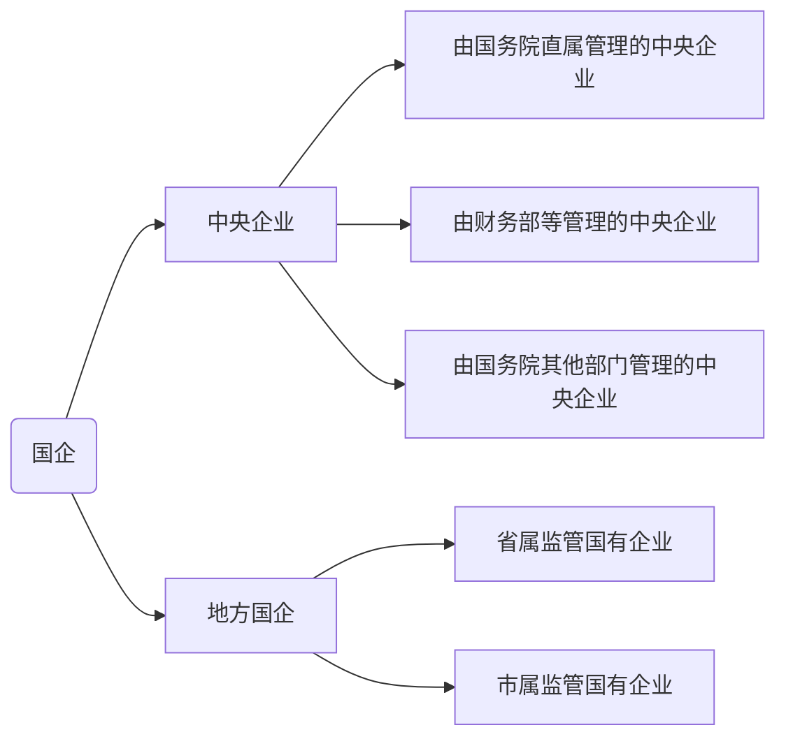

# 快速了解国企，看这篇科普就够啦

最近总有同学问李梨，什么是国企？为什么选择国企？国企和央企有什么区别？今天这篇文章给大家做一个全面的总结！

## **一、国企简介** 

###  1. 含义 

我国的国有企业是指企业全部资产归国家所有，并按《中华人民共和国企业法人登记管理条例》规定登记注册的非公司制的经济组织。不包括有限责任公司中的国有独资公司。 

###  2. 地位 

  国有企业是我国国民经济中的中流砥柱。 

  国有企业是抗衡跨国公司的主力军。 

  国有企业是我国支柱产业的重要支撑。 

##  **二、国企分类** 

###  1. 性质分类 

  特殊法人国企：直接提供公共服务。像国防设施、城市公交、城市绿化、水利等。 

  国有独资公司：这类企业以社会公共目标为主，经济目标居次。如铁路、自来水、天然气、电力、机场等。 

  国有控股公司：准自然垄断企业和国民经济发展的支柱产业，如电子、汽车、医药、机场。 

  国有参股（合资）：一汽大众、福田汽车，海尔等。 

###  2. 级别分类 

 国务院直属企业3家：中信集团有限公司、中国铁路总公司、中国投资有限责任公司。

 央企：[国家电网]()、三大运营商、邮政、中石化、中石油等。

 省级龙头企业：光明乳业（上海）、新湖科技（广东）。

 省市国资委下属的企业：水务（排水）、燃气、投资集团、新华书店、机场、南水北调、储备粮、地铁、矿业、能源、旅游等。

 其他县办、乡办企业。

###   3.国企和央企区别

国企指一切归国资委管理的企业，分为国务院直属和地方直属，前者称为央企，后者称为地方国企。**也就是说，国企实则包含了央企**。二者主要区别如下： 

  ① 规模不同，央企的规模都较大，福利待遇较好； 

  ② 地位不同，央企基本是行业龙头，是全民所有制企业； 

  ③ 数量不同，央企总数不超百家，而地方国企有上千家。 

##   **三、国企重要性** 

首先，大型国有企业是我国国民经济中的中流砥柱。虽然通过“抓大放小”，一部分国有中小企业以租赁、承包、售出、参股等方式向产权多元化转变。但是，国有和国有控股企业在几乎所有的工业领域仍占据主导地位。 

其次，大型国有企业是抗衡跨国公司的主力军。中国加入WTO以后，国际知名的大型跨国公司大举进攻中国市场，各种洋货猛烈冲击国货。尽管民营经济已经有了很大的发展，但是由于其在技术、质量、规模等方面的显著差距，尚不能与跨国公司抗衡，而只有大型国有企业才是抗衡跨国公司的生力军。再次，大型国有企业是我国支柱产业的重要支撑。在石油、化工、[机械]()、电子、冶金、有色和建材等重要产业中，我国七大[汽车]()集团占全行业总产值的66%；嘉陵、北方、轻骑、金城四大摩托车集团占全国总产量的一半；上海、东方、哈尔滨三大发电设备集团，提供国内电站设备的70%。 

最后，大型国有企业仍是出口创汇的主要力量。国有企业出口创汇额超过了外商投资企业，居于领先地位。其中，大多数大型国有企业以[销售]()额的1%左右投入研究与开发，有的达到2%，技术进步处于国内工业企业领先地位。 

##  **四、国企发展基本特点** 

###  1. 国企地区分布 （含央企）

从国有企业的地域分布来看，上海、广东、山东、江苏、安徽、浙江等经济较发达区域，国企数量多，且整体资产质量较好。不同区域的国企，资产的分布状况也各有不同，如上海资产主要集中在[汽车]()、建筑、房[地产]()、电力设备、商贸零售行业，山东资产主要集中在煤炭、[汽车]()、钢铁、基础化工，而江苏省资产集中在房[地产]()、[机械]()、交通运输、食品饮料、[汽车]()。 

  

###  2. 国企行业分布 

从行业结构上来看，金融服务、采掘、交通运输、黑色金属和公共事业等具有垄断性质的企业，国企占比最高，控股市值占比平均达到90%以上。相对的，医药、电子、家电、纺织等竞争性行业国资控股占比较低。国有资本在包括金融、军工、电网电力、石油石化、电信、煤炭、民航、航运等领域具有绝对的控制力。

###  3. 国企营收及利润趋势 

纵观全国国有及国有控股企业在经营上的表现，其经济运行继续保持较好的态度，在创造营收、盈利能力和偿债能力上均逐年提升。但盈利和亏损企业在不同年份上均有所不同，在化工、有色等行业较为常见。 

##  **五、国企优势** 

### 1. 正式编制 

 考生通过国企所有的考试，就可以成为正式编制员工。不仅享受优越的福利待遇，而且拥有良好的发展空间。 

### 2. 机会多 

国有企业主要分布在国民经济的命脉行业，如社会服务业和交通运输业，随着我国国有企业的改革深入，国企对于人才的需求不断扩张。在未来的十年，每年都可能为相关专业毕业生提供几十万个就业岗位！ 

如[国家电网]()公司2017年招聘中，招聘人数将近2万人，而每一批次的报名人数都达到20多万人次。 

[中国石油]()化工集团公司、[中国人寿]()保险公司、中国邮政集团公司招聘人数也在3500人以上，因此国有企业每年的招聘规模都非常庞大，是毕业生选择就业的绝佳机会。 

### 3. 福利待遇优越 

国企的福利待遇主要由基本工资、基础绩效和浮动绩效、年终奖、各种福利补贴、五险一金等构成。在国企中，[国家电网]()、烟草、中石化、中石油的福利待遇相对较好。除此之外，铁路、航空、运营商待遇也都不错。 

###  4. 职位选择相对较多 

我国的国有企业数量众多，行业分布广泛，招聘的职位和专业也相对较多。对于不同专业的毕业生来说，在国有企业都能找到相对应的职位需求。  

###  5. 其他优势 

（1）不容易因为外在环境的变化，例如经济风暴，大幅度裁员。 

（2）国有企业酬劳稳定上升，国有企业部分的考核机制，还是以“年资”为主，成果为辅。

（3）国有企业年资不因为内部调动，甚至国有企业间调动，而影响个人年资。 

（4）国有企业对于“守法”的概念，远远强过私营企业；因为国有企业员工的权益相对被保护得更好。 

（5）国有企业更多的服务于计划，工作相对压力比私营企业小。 

这次给大家科普了一下国企和央企的特点，下一篇文章给大家介绍全国各省市的国企名单和国央企的招聘信息！

# 国央企投递指南

上期文章给大家介绍了下国央企的区别，那么有很多同学就问了。

> 你讲了那么多国央企的优点？那么要怎么投递呢！
>
> 还有还有，我也不知道有什么国企呀！能详细说说吗？

咳咳咳～别急别急，老夫这就慢慢到来。

## 一、国企招聘信息汇总

- [国聘网](https://www.iguopin.com/)
- [国资央企招聘平台](https://cujiuye.iguopin.com/)
- [应届生求职网](https://www.yingjiesheng.com/)
- [公招网](https://www.gongzhao.com.cn/index.shtml)
- [人力资源和社会保障网](http://www.gjzhaopin.cn/LPSC/LEAP/lpsc/html/recruitList.html)
- [中智招聘网](https://myjob500.com/)
- [国务院国资委网](http://www.sasac.gov.cn/n2588035/n2588325/index.html)

除此之外，李梨同学也会在本公众号定期给大家推送国企的招聘信息哦！

## 二、国务院直属中央企业

| 国务院直属中央企业（3）  |                      |                  |
| ------------------------ | -------------------- | ---------------- |
| 中国国家铁路集团有限公司 | 中国投资有限责任公司 | 中信集团有限公司 |

## 三、国务院国资委管理的中央企业

| 国务院国资委管理的中央企业（97） |                              |                                            |                                      |                                                |
| -------------------------------- | ---------------------------- | ------------------------------------------ | ------------------------------------ | ---------------------------------------------- |
| 中国核工业集团有限公司           | 中国航天科技集团有限公司     | 中国航天科工集团有限公司                   | 中国航空工业集团有限公司             | 中国船舶集团有限公司                           |
| 中国兵器工业集团有限公司         | 中国兵器装备集团有限公司     | 中国电子科技集团有限公司                   | 中国航空发动机集团有限公司           | 中国融通资产管理集团有限公司                   |
| 中国石油天然气集团有限公司       | 中国石油化工集团有限公司     | 中国海洋石油集团有限公司                   | 国家石油天然气管网集团有限公司       | 国家电网有限公司                               |
| 中国南方电网有限责任公司         | 中国华能集团有限公司         | 中国大唐集团有限公司                       | 中国华电集团有限公司                 | 国家电力投资集团有限公司                       |
| 中国长江三峡集团有限公司         | 国家能源投资集团有限责任公司 | 中国电信集团有限公司                       | 中国联合网络通信集团有限公司         | 中国移动通信集团有限公司                       |
| 中国卫星网络集团有限公司         | 中国电子信息产业集团有限公司 | 中国第一汽车集团有限公司                   | 东风汽车集团有限公司                 | 中国一重集团有限公司                           |
| 中国机械工业集团有限公司         | 哈尔滨电气集团有限公司       | 中国东方电气集团有限公司                   | 鞍钢集团有限公司                     | 中国宝武钢铁集团有限公司                       |
| 中国铝业集团有限公司             | 中国远洋海运集团有限公司     | 中国航空集团有限公司                       | 中国东方航空集团有限公司             | 中国南方航空集团有限公司                       |
| 中国中化控股有限责任公司         | 中粮集团有限公司             | 中国五矿集团有限公司                       | 中国通用技术（集团）控股有限责任公司 | 中国建筑集团有限公司                           |
| 中国储备粮管理集团有限公司       | 国家开发投资集团有限公司     | 招商局集团有限公司                         | 华润（集团）有限公司                 | 中国旅游集团有限公司[香港中旅（集团）有限公司] |
| 中国商用飞机有限责任公司         | 中国节能环保集团有限公司     | 中国国际工程咨询有限公司                   | 中国诚通控股集团有限公司             | 中国中煤能源集团有限公司                       |
| 中国煤炭科工集团有限公司         | 机械科学研究总院集团有限公司 | 中国中钢集团有限公司                       | 中国钢研科技集团有限公司             | 中国化学工程集团有限公司                       |
| 中国盐业集团有限公司             | 中国建材集团有限公司         | 中国有色矿业集团有限公司                   | 有研科技集团有限公司                 | 矿冶科技集团有限公司                           |
| 中国国际技术智力合作集团有限公司 | 中国建筑科学研究院有限公司   | 中国中车集团有限公司                       | 中国铁路通信信号集团有限公司         | 中国铁路工程集团有限公司                       |
| 中国铁道建筑集团有限公司         | 中国交通建设集团有限公司     | 中国普天信息产业集团有限公司               | 中国信息通信科技集团有限公司         | 中国农业发展集团有限公司                       |
| 中国林业集团有限公司             | 中国医药集团有限公司         | 中国保利集团有限公司                       | 中国建设科技有限公司                 | 中国冶金地质总局                               |
| 中国煤炭地质总局                 | 新兴际华集团有限公司         | 中国民航信息集团有限公司                   | 中国航空油料集团有限公司             | 中国航空器材集团有限公司                       |
| 中国电力建设集团有限公司         | 中国能源建设集团有限公司     | 中国安能建设集团有限公司                   | 中国黄金集团有限公司                 | 中国广核集团有限公司                           |
| 中国华录集团有限公司             | 华侨城集团有限公司           | 南光（集团）有限公司[中国南光集团有限公司] | 中国西电集团有限公司                 | 中国铁路物资集团有限公司                       |
| 中国国新控股有限责任公司         | 中国检验认证（集团）有限公司 |                                            |                                      |                                                |

## 四、各省市国有企业

| 北京市（42）                       |                              |                              |                                  |                              |
| ---------------------------------- | ---------------------------- | ---------------------------- | -------------------------------- | ---------------------------- |
| 北京城市副中心投资建设集团有限公司 | 北京首农食品集团有限公司     | 北京市建筑设计研究院有限公司 | 北京市供销合作总社               | 北京国有资本经营管理中心     |
| 北京市保障性住房建设投资中心       | 北京水务投资中心             | 北京航空有限责任公司         | 北京金融控股集团有限公司         | 永定河流域投资有限公司       |
| 北京首都开发控股（集团）有限公司   | 北京实业开发总公司           | 北京[汽车]()集团有限公司     | [北京建工]()集团有限责任公司     | 北京城建集团有限责任公司     |
| 北京外企服务集团有限责任公司       | 北京京城机电控股有限责任公司 | 北京一轻控股有限责任公司     | 北京时尚控股有限责任公司         | 北京化学工业集团有限责任公司 |
| 北京同仁堂有限责任公司             | 北京金隅集团股份有限公司     | 北京北辰实业集团有限责任公司 | 北京市首都公路发展集团有限公司   | 北京祥龙资产经营有限责任公司 |
| 北京城市排水集团有限责任公司       | 北京环境卫生工程集团有限公司 | [首钢集团]()有限公司         | 北京公共交通控股（集团）有限公司 | 北京市基础设施投资有限公司   |
| 北京市地铁运营有限公司             | 北京首都旅游集团有限责任公司 | 北京控股集团有限公司         | 北京能源集团有限责任公司         | 北京首都创业集团有限公司     |
| 北京市国有资产经营有限责任公司     | 北京市自来水集团有限责任公司 | [北京银行]()股份有限公司     | [华夏银行]()股份有限公司         | 北京国际信托有限公司         |
| 北京农村商业银行股份有限公司       | 北京电子控股有限责任公司     |                              |                                  |                              |

| 福建省（17）                   |                                          |                                |                                |                            |
| ------------------------------ | ---------------------------------------- | ------------------------------ | ------------------------------ | -------------------------- |
| 福建省高速公路集团有限公司     | 福建省投资开发集团有限责任公司           | 福建省冶金（控股）有限责任公司 | 福建省能源石化集团有限责任公司 | 福建省港口集团有限责任公司 |
| 福建省[汽车]()工业集团有限公司 | 福建省电子信息（集团）有限责任公司       | 福建省船舶工业集团有限公司     | 福建建工集团有限责任公司       | 福建省旅游发展集团         |
| 福建省机电（控股）有限责任公司 | 中国（福建）对外贸易中心集团有限责任公司 | 福建省轻纺（控股）有限责任公司 | 福建省招标采购集团有限公司     | 福建省水利投资开发集团     |
| 福建省大[数据]()有限公司       | 福建省国有资产管理有限公司               |                                |                                |                            |

| 广东省（18）               |                            |                                |                            |                            |
| -------------------------- | -------------------------- | ------------------------------ | -------------------------- | -------------------------- |
| 广东省机场管理集团有限公司 | 广东省环保集团有限公司     | 广东省广晟控股集团有限公司     | 广东省能源集团有限公司     | 广东省交通集团有限公司     |
| 广东省港航集团有限公司     | 广东省广物控股集团有限公司 | 广东省建筑工程集团有限公司     | 广东省广新控股集团有限公司 | 广东省旅游控股集团有限公司 |
| 广东粤海控股集团有限公司   | 广东省盐业集团有限公司     | 广东省铁路建设投资集团有限公司 | 广东恒健投资控股有限公司   | 广东南粤集团有限公司       |
| 广东省粤科金融集团有限公司 | 广东省广轻控股集团有限公司 | 广东省交易控股集团有限公司     |                            |                            |

| 广西省（19）                   |                            |                              |                                |                              |
| ------------------------------ | -------------------------- | ---------------------------- | ------------------------------ | ---------------------------- |
| 广西农垦集团有限责任公司       | 广西北部湾银行             | 广西[玉柴]()机器集团有限公司 | 广西农村投资集团有限公司       | 广西宏桂资本运营集团有限公司 |
| 广西林业集团                   | 广西现代物流集团有限公司   | 广西投资集团有限公司         | 广西柳州钢铁集团有限公司       | 广西机场管理集团有限责任公司 |
| 广西壮族自治区农村信用社联合社 | 广西北部湾投资集团有限公司 | 广西交通投资集团有限公司     | 广西旅游发展集团               | 中国广西国际经济技术合作公司 |
| 广西[柳工集团]()有限公司       | 广西[汽车]()集团有限公司   | 广西国宏发展集团有限公司     | 广西北部湾国际港务集团有限公司 |                              |

| 贵州省（27）                         |                                      |                                      |                                      |                                  |
| ------------------------------------ | ------------------------------------ | ------------------------------------ | ------------------------------------ | -------------------------------- |
| 中国贵州茅台酒厂（集团）有限责任公司 | 贵州磷化（集团）有限责任公司         | 贵州盘江煤电集团有限责任公司         | 贵州高速公路集团有限公司             | 贵州省机场集团有限公司           |
| 贵州航空投资控股集团有限责任公司     | 贵州省黔晟国有资产经营有限责任公司   | 贵州旅游投资控股（集团）有限责任公司 | 贵州现代物流产业（集团）有限责任公司 | 贵州乌江能源集团有限责任公司     |
| 云上贵州大[数据]()（集团）有限公司   | 七冶建设有限责任公司                 | 贵州酒店集团有限公司                 | 贵州钢绳（集团）有限责任公司         | 西南能矿集团股份有限公司         |
| 贵州盐业（集团）有限责任公司         | 贵州省建筑设计研究院有限责任公司     | 贵州遵钛（集团）有限责任公司         | 贵州建工集团有限责任公司             | 首钢水城钢铁（集团）有限责任公司 |
| 贵州乌江水电开发有限责任公司         | 首钢贵阳特殊钢有限责任公司           | 中国振华电子集团有限公司             | 保利久联控股集团有限责任公司         | 贵州航空有限公司                 |
| 贵州水红铁路有限责任公司             | [国家电投]()集团贵州金元股份有限公司 |                                      |                                      |                                  |

| 河南省（29）                       |                                      |                                  |                                  |                                |
| ---------------------------------- | ------------------------------------ | -------------------------------- | -------------------------------- | ------------------------------ |
| 河南能源化工集团有限公司           | 安阳钢铁集团有限责任公司             | 河南中豫国际港务集团有限公司     | 河南投资集团有限公司             | 河南省民航发展投资有限公司     |
| 河南省国有资产控股运营集团有限公司 | 洛阳单晶硅集团有限责任公司           | 中国河南国际合作集团有限公司     | 河南豫港控股集团                 | 河南省农业综合开发有限公司     |
| 中原豫资投资控股集团有限公司       | 河南省中原石油天然气集团有限公司     | 郑州煤矿[机械]()集团股份有限公司 | 中原证券股份有限公司             | 河南粮食投资集团有限公司       |
| 中国平煤神马集团                   | 郑州煤炭工业有限责任公司             | 河南省机场集团有限公司           | 河南交通投资集团有限公司         | 河南省铁路建设投资集团有限公司 |
| 洛阳铜加工集团有限责任公司         | 郑州粮食批发市场有限公司             | 河南中豫建设投资集团股份有限公司 | 河南省盐业集团有限公司           | 河南水利投资集团有限公司       |
| 河南省自然资源投资集团有限公司     | 河南[机械]()装备投资集团有限责任公司 | 中原信托有限公司                 | 中原出版传媒投资控股集团有限公司 |                                |

| 黑龙江省（12）               |                                    |                                |                              |                              |
| ---------------------------- | ---------------------------------- | ------------------------------ | ---------------------------- | ---------------------------- |
| 中国龙江森林工业集团有限公司 | 黑龙江省建设投资集团有限公司       | 黑龙江省新产业投资集团有限公司 | 黑龙江省机场管理集团有限公司 | 黑龙江省铁路集团有限责任公司 |
| 黑龙江交易集团有限公司       | 黑龙江龙煤矿业控股集团有限责任公司 | 黑龙江省交通投资集团有限公司   | 黑龙江省农业投资集团有限公司 | 黑龙江省航运集团有限公司     |
| 黑龙江省龙睿资产经营有限公司 | 黑龙江省龙裕集团有限公司           |                                |                              |                              |

| 湖南省（18）                 |                            |                                  |                          |                              |
| ---------------------------- | -------------------------- | -------------------------------- | ------------------------ | ---------------------------- |
| 湖南钢铁集团有限公司         | 湖南湘投控股集团有限公司   | 湖南省建工集团有限公司           | 长丰集团有限责任公司     | 湘电集团有限公司             |
| 湖南省煤业集团有限公司       | 湖南省轻工盐业集团有限公司 | 湖南海利高新技术产业集团有限公司 | 湖南湘科控股集团有限公司 | 湖南兴湘投资控股集团有限公司 |
| 湖南发展资产管理集团有限公司 | 湖南高新创投集团有限公司   | 湖南轨道交通控股集团有限公司     | 湖南省湘水集团有限公司   | 湖南省建筑设计院有限公司     |
| 现代农业产业控股集团有限公司 | 湖南省高速公路集团有限公司 | 湖南省机场管理集团有限公司       |                          |                              |

| 江苏省（26）                         |                                  |                            |                                |                            |
| ------------------------------------ | -------------------------------- | -------------------------- | ------------------------------ | -------------------------- |
| 江苏省国信集团有限公司               | 江苏交通控股有限公司             | 东部机场集团有限公司       | 江苏省农村信用社联合社         | 江苏省苏豪控股集团有限公司 |
| 中国江苏国际经济技术合作集团有限公司 | 江苏省海外企业集团有限公司       | 江苏省农垦集团有限公司     | 徐州矿务集团有限公司           | 江苏省沿海开发集团有限公司 |
| [华泰证券]()                         | 江苏汇鸿国际集团股份有限公司     | 江苏省港口集团有限公司     | 江苏省铁路集团有限公司         | 江苏省环保集团有限公司     |
| 江苏省盐业集团有限责任公司           | 江苏省粮食集团有限责任公司       | 江苏高科技投资集团         | 南京金陵饭店集团有限公司       | 江苏钟山宾馆集团有限公司   |
| 江苏省惠隆资产管理有限公司           | 南水北调东线江苏水源有限责任公司 | 江苏省体育产业集团有限公司 | 江苏省国金资本运营集团有限公司 | 江苏省规划设计集团有限公司 |
| 江苏省联合征信有限公司               |                                  |                            |                                |                            |

| 辽宁省（13）                     |                                |                                    |                              |                                    |
| -------------------------------- | ------------------------------ | ---------------------------------- | ---------------------------- | ---------------------------------- |
| 辽宁铁法能源有限责任公司         | 辽宁省粮食发展集团有限责任公司 | 鞍钢集团本钢集团有限公司           | 华晨[汽车]()集团控股有限公司 | 辽宁省交通建设投资集团有限责任公司 |
| 辽宁省水资源管理集团有限责任公司 | 中天证券有限责任公司           | 辽宁省机场管理集团公司             | 辽渔集团有限公司             | 辽宁省环保集团有限责任公司         |
| 辽宁时代万恒控股集团有限公司     | 辽宁省展览贸易集团有限公司     | 辽宁省地质勘探矿业集团有限责任公司 |                              |                                    |

| 山东省（25）                   |                              |                          |                                  |                              |
| ------------------------------ | ---------------------------- | ------------------------ | -------------------------------- | ---------------------------- |
| 山东省商业集团有限公司         | 山东钢铁集团有限公司         | 山东黄金集团有限公司     | 华鲁控股集团有限公司             | 山东能源集团有限公司         |
| 山东高速集团有限公司           | 山东机场集团有限公司         | 山东土地发展集团有限公司 | 山东省国有资产投资控股有限公司   | 山东发展投资控股集团有限公司 |
| 山东铁路投资控股有限公司       | 山东省港口集团有限公司       | [山东重工]()集团有限公司 | 山东国惠投资有限公司             | 山东鲁华能源集团有限公司     |
| 深圳市东华实业（集团）有限公司 | 上海齐鲁实业（集团）有限公司 | 山东产权交易中心有限公司 | 山东特种设备检验检测集团有限公司 | 山东泰山地勘集团有限公司     |
| 山东山科控股集团有限公司       | 山东鲁粮集团有限公司         | 水发集团有限公司         | 山东海洋集团有限公司             | 泰山财产保险股份有限公司     |

| 上海市（41）                 |                              |                              |                                  |                                        |
| ---------------------------- | ---------------------------- | ---------------------------- | -------------------------------- | -------------------------------------- |
| 上海国际集团有限公司         | 上海国盛（集团）有限公司     | 上海国有资本投资有限公司     | [上海机场]()（集团）有限公司     | 上海临港经济发展（集团）有限公司       |
| 上海[地产]()（集团）有限公司 | 上海城投（集团）有限公司     | 上海久事（集团）有限公司     | 上海[申通]()地铁集团有限公司     | 上海申迪（集团）有限公司               |
| 上海联和投资有限公司         | 上海联合产权交易所有限公司   | 长三角投资（上海）有限公司   | 上海科技创业投资（集团）有限公司 | [中国太平]()洋保险（集团）股份有限公司 |
| 上海浦东发展银行股份有限公司 | [上海银行]()股份有限公司     | 上海农村商业银行股份有限公司 | [国泰君安]()证券股份有限公司     | [海通证券]()股份有限公司               |
| 上海[汽车]()集团股份有限公司 | [上海电气]()集团股份有限公司 | 上海华谊集团股份有限公司     | 上海实业（集团）有限公司         | 上海国际港务（集团）股份有限公司       |
| 申能（集团）有限公司         | [上海建工]()集团股份有限公司 | 上海仪电（集团）有限公司     | 光明食品（集团）有限公司         | 上海隧道工程股份有限公司               |
| 华东建筑集团股份有限公司     | 百联集团有限公司             | 锦江国际（集团）有限公司     | 东浩兰生（集团）有限公司         | 上海华虹（集团）有限公司               |
| 东方国际（集团）有限公司     | 上海建科集团股份有限公司     | 上海投资咨询集团有限公司     | 绿地控股集团股份有限公司         | 上海市供销合作总社                     |
| 上海新集体经济合作联社       |                              |                              |                                  |                                        |

| 四川省（16）                     |                                |                                  |                                        |                                |
| -------------------------------- | ------------------------------ | -------------------------------- | -------------------------------------- | ------------------------------ |
| 四川产业振兴发展投资基金有限公司 | [四川华西集团]()有限公司       | 四川省煤炭产业集团有限责任公司   | 紫坪铺公司                             | 四川发展集团                   |
| 四川省交通投资集团有限责任公司   | 四川省能源投资集团有限责任公司 | 四川省投资集团有限责任公司       | 四川省铁路投资集团有限责任公司         | 四川省商业投资集团有限责任公司 |
| 四川省旅游投资集团有限责任公司   | 机场集团                       | 四川富润企业重组投资有限责任公司 | 四川省国有资产经营投资管理有限责任公司 | 四川省有色科技集团有限责任公司 |
| 四川省矿业投资集团有限责任公司   |                                |                                  |                                        |                                |

| 天津市（29）                     |                              |                              |                                  |                                      |
| -------------------------------- | ---------------------------- | ---------------------------- | -------------------------------- | ------------------------------------ |
| 天津百利[机械]()装备集团有限公司 | 天津纺织集团（控股）有限公司 | 天津津融投资服务集团有限公司 | 天津轨道交通集团有限公司         | 天津食品集团有限公司                 |
| [天津泰达]()投资控股有限公司     | 天津水务集团有限公司         | 天津房[地产]()集团有限公司   | 天津劝业华联集团有限公司         | 天津利和进出口集团有限公司           |
| 天津市政建设集团有限公司         | [天津银行]()股份有限公司     | [渤海银行]()股份有限公司     | 天津滨海农村商业银行股份有限公司 | 天津渤海轻工投资集团有限公司         |
| 天津渤海化工集团有限责任公司     | 天津物产集团有限公司         | 天津市交通(集团)有限公司     | 天津能源投资集团有限公司         | 天津城市基础设施建设投资集团有限公司 |
| 天津市旅游（控股）集团有限公司   | 天津港（集团）有限公司       | 北方国际集团有限公司         | 天津城建集团有限公司             | 天津市公共交通集团（控股）有限公司   |
| 天津农村商业银行股份有限公司     | 渤海证券股份有限公司         | 北方国际信托股份有限公司     | 天津产权交易中心                 |                                      |

| 云南省（29）                       |                                |                                  |                                    |                                    |
| ---------------------------------- | ------------------------------ | -------------------------------- | ---------------------------------- | ---------------------------------- |
| 昆明钢铁集团有限责任公司           | 云南省投资控股集团有限公司     | 云南锡业集团（控股）有限责任公司 | [云天化]()集团有限责任公司         | 云南省煤炭产业集团有限公司         |
| 云南省航空产业投资集团有限责任公司 | 云南省建设投资控股集团有限公司 | 云南农垦集团有限责任公司         | 云南省工业投资控股集团有限责任公司 | 云南省康旅控股集团有限公司         |
| 云南省能源投资集团有限公司         | 云南省国有股权运营管理有限公司 | 富滇银行股份有限公司             | 云南省国有资本运营有限公司         | 云南省贵金属新材料控股集团有限公司 |
| 云南省设计院集团有限公司           | 云南省戎合投资控股有限公司     | 云南白药控股有限公司             | 中国铜业有限公司                   | 东方航空云南有限公司               |
| 云南外事服务中心                   | 云南金马集团有限责任公司       | 云南省滇中引水工程有限公司       | 云南融聚发展投资有限公司           | 云南省城际轨道投资控股有限公司     |
| 云南联[云集]()团有限责任公司       | 云南云勤服务集团有限责任公司   | 云南省交通投资建设集团有限公司   | 云南省农村信用社联合社             |                                    |

| 浙江省（17）               |                          |                                |                            |                            |
| -------------------------- | ------------------------ | ------------------------------ | -------------------------- | -------------------------- |
| 浙江省国有资本运营有限公司 | 物产中大集团股份有限公司 | 浙江省建设投资集团股份有限公司 | 浙江省机电集团有限公司     | 浙江省国际贸易集团有限公司 |
| 浙江省旅游投资集团有限公司 | 杭州钢铁集团有限公司     | 巨化集团有限公司               | 浙江省能源集团有限公司     | 浙江省交通投资集团有限公司 |
| 浙江省农村发展集团有限公司 | 浙江省机场集团有限公司   | 浙江省海港投资运营集团有限公司 | 浙江省二轻集团有限责任公司 | 安邦护卫集团股份有限公司   |
| 浙江大学控股集团有限公司   | 浙江产权交易所有限公司   |                                |                            |                            |

| 重庆市（37）                       |                                    |                                  |                                      |                                    |
| ---------------------------------- | ---------------------------------- | -------------------------------- | ------------------------------------ | ---------------------------------- |
| 重庆设计集团有限公司               | 重庆股份转让中心有限责任公司       | 重庆兴农融资担保集团有限公司     | 重庆进出口融资担保有限公司           | 重庆联合产权交易所集团股份有限公司 |
| 民生实业（集团）有限公司           | 重庆对外经贸（集团）有限公司       | 重庆国际投资咨询集团有限公司     | 重庆市农业投资集团有限公司           | 重庆交通运输控股（集团）有限公司   |
| 数字重庆大[数据]()应用发展有限公司 | 重庆旅游投资集团有限公司           | 重庆市储备粮管理有限公司         | 重庆粮食集团有限责任公司             | 重庆国际物流集团有限公司           |
| 重庆广阳岛绿色发展有限责任公司     | 西南证券股份有限公司               | 重庆渝富控股集团有限公司         | 重庆城市交通开发投资（集团）有限公司 | 重庆市[地产]()集团有限公司         |
| 重庆高速公路集团有限公司           | 重庆市城市建设投资（集团）有限公司 | 重庆水务环境控股集团有限公司     | 重庆建工投资控股有限责任公司         | 重庆市能源投资集团有限公司         |
| [重庆机电]()控股（集团）公司       | 重庆轻纺控股（集团）公司           | 重庆化医控股（集团）公司         | 重庆钢铁（集团）有限责任公司         | 庆铃[汽车]()（集团）有限公司       |
| 重庆农村土地交易所有限责任公司     | 重庆机场集团有限公司               | 重庆三峡融资担保集团股份有限公司 | 重庆市水利投资（集团）有限公司       | 重庆三峡银行股份有限公司           |
| 重庆银行                           | 重庆农村商业银行股份有限公司       |                                  |                                      |                                    |

| 山西省（18）                 |                          |                            |                                |                                    |
| ---------------------------- | ------------------------ | -------------------------- | ------------------------------ | ---------------------------------- |
| 山西焦煤集团有限责任公司     | 晋能控股集团有限公司     | 华阳新材料科技集团有限公司 | 潞安化工集团有限公司           | 华新燃气集团有限公司               |
| 太原重型[机械]()集团有限公司 | 山西国际能源集团有限公司 | 华远国际陆港集团有限公司   | 万家寨水务控股集团有限公司     | 山西省文化旅游投资控股集团有限公司 |
| 山西交通控股集团有限公司     | 山西航空产业集团有限公司 | 山西建设投资集团有限公司   | 山西杏花村汾酒集团有限责任公司 | 山西大地环境投资控股有限公司       |
| 山[西云]()时代技术有限公司   | 华舰体育控股集团有限公司 | 神农科技集团有限公司       |                                |                                    |

| 新疆（8）                            |                          |                                |                                  |                  |
| ------------------------------------ | ------------------------ | ------------------------------ | -------------------------------- | ---------------- |
| 新疆有色金属工业（集团）有限责任公司 | 新疆中泰化学股份有限公司 | 新疆新能源（集团）有限责任公司 | 新疆投资发展（集团）有限责任公司 | 新疆雪峰科技集团 |
| 新疆交通建设集团                     | 新疆金头公司             | 新疆建筑设计研究院             |                                  |                  |

| 新疆兵团（8）                      |                          |                              |                                  |                                  |
| ---------------------------------- | ------------------------ | ---------------------------- | -------------------------------- | -------------------------------- |
| 兵团国有资产经营有限责任公司       | 兵团投资有限责任公司     | 兵团供销合作总公司           | 新疆银隆农业国际合作股份有限公司 | 兵团城市建设投资集团有限责任公司 |
| 兵团勘测设计院（集团）有限责任公司 | 兵团工程咨询有限责任公司 | 中新建国际农业合作有责任公司 |                                  |                                  |

| 宁夏（14）                       |                              |                          |                                  |                      |
| -------------------------------- | ---------------------------- | ------------------------ | -------------------------------- | -------------------- |
| 宁夏农垦集团公司                 | 宁夏国有资本运营集团公司     | 宁夏建设投资集团公司     | 宁夏旅游投资集团公司             | 宁夏交通投资集团公司 |
| 宁夏农业投资集团公司             | 宁夏国有资产投资控股集团公司 | 宁夏西部创业实业股份公司 | 宁夏国大药房连锁公司             | 国药控股宁夏公司     |
| 国家能源集团宁夏煤业有限责任公司 | 中铝宁夏能源集团公司         | 中色（宁夏）东方集团公司 | [国家电投]()集团宁夏能源铝业公司 |                      |

| 内蒙古（18）                         |                                    |                                      |                                    |                                      |
| ------------------------------------ | ---------------------------------- | ------------------------------------ | ---------------------------------- | ------------------------------------ |
| 包头钢铁（集团）有限责任公司         | 内蒙古森林工业集团有限责任公司     | 内蒙古电力（集团）有限责任公司       | 内蒙古能源发电投资集团有限责任公司 | 内蒙古自治区民航机场集团有限责任公司 |
| 内蒙古环保投资集团有限公司           | 内蒙古交通投资（集团）有限责任公司 | 内蒙古高速公路集团有限责任公司       | 内蒙古公路交通投资发展有限公司     | 内蒙古水务投资集团有限公司           |
| 内蒙古国有资本运营有限公司           | 内蒙古蒙盐盐业集团有限公司         | 内蒙古新城宾馆旅游业集团有限责任公司 | 内蒙古威信保安押运服务有限责任公司 | 内蒙古产权交易中心有限责任公司       |
| 内蒙古恒基建设工程施工图审查有限公司 | 北京内蒙古大厦有限责任公司         | 内蒙古兴源（香港）有限公司           |                                    |                                      |

| 安徽省（29）                   |                                |                                  |                                    |                                    |
| ------------------------------ | ------------------------------ | -------------------------------- | ---------------------------------- | ---------------------------------- |
| 安徽省交通控股集团有限公司     | 安徽海螺集团有限责任公司       | 安徽省能源集团有限公司           | 淮北矿业集团                       | 淮河能源控股集团有限责任公司       |
| 安徽国元控股(集团)有限责任公司 | 安徽省投资集团控股有限公司     | [铜陵有色金属]()集团控股有限公司 | 安徽[江淮汽车]()集团控股有限公司   | 安徽省皖北煤电集团有限责任公司     |
| [华安证券]()股份有限公司       | 安徽省引江济淮集团有限公司     | 安徽省港航集团有限公司           | 安徽叉车集团有限责任公司           | 安徽省国有资本运营控股集团有限公司 |
| 安徽建工集团控股有限公司       | 安徽民航机场集团有限公司       | 安徽省农垦集团有限公司           | 煤炭工业合肥设计研究院有限责任公司 | 安徽军工集团控股有限公司           |
| 安徽皖维集团有限责任公司       | 安徽省皖中集团有限责任公司     | 中煤矿山建设集团有限责任公司     | 安徽省旅游集团有限责任公司         | 安徽省徽商集团有限公司             |
| 安徽省盐业投资控股集团有限公司 | 安徽省华强工贸集团有限责任公司 | 安徽淮海实业发展集团有限公司     | 安徽省通航控股集团有限公司         |                                    |

这么多国央企，总有一款适合你！

最后祝大家都能找到适合自己的工作！

# 国央企投递指南

上期文章给大家介绍了下国央企的区别，那么有很多同学就问了。

> 你讲了那么多国央企的优点？那么要怎么投递呢！
>
> 还有还有，我也不知道有什么国企呀！能详细说说吗？

咳咳咳～别急别急，老夫这就慢慢到来。

## 一、国企招聘信息汇总

- [国聘网](https://www.iguopin.com/)
- [国资央企招聘平台](https://cujiuye.iguopin.com/)
- [应届生求职网](https://www.yingjiesheng.com/)
- [公招网](https://www.gongzhao.com.cn/index.shtml)
- [人力资源和社会保障网](http://www.gjzhaopin.cn/LPSC/LEAP/lpsc/html/recruitList.html)
- [中智招聘网](https://myjob500.com/)
- [国务院国资委网](http://www.sasac.gov.cn/n2588035/n2588325/index.html)

除此之外，李梨同学也会在本公众号定期给大家推送国企的招聘信息哦！

## 二、国务院直属中央企业

| 国务院直属中央企业（3）  |                      |                  |
| ------------------------ | -------------------- | ---------------- |
| 中国国家铁路集团有限公司 | 中国投资有限责任公司 | 中信集团有限公司 |

## 三、国务院国资委管理的中央企业

| 国务院国资委管理的中央企业（97） |                              |                                            |                                      |                                                |
| -------------------------------- | ---------------------------- | ------------------------------------------ | ------------------------------------ | ---------------------------------------------- |
| 中国核工业集团有限公司           | 中国航天科技集团有限公司     | 中国航天科工集团有限公司                   | 中国航空工业集团有限公司             | 中国船舶集团有限公司                           |
| 中国兵器工业集团有限公司         | 中国兵器装备集团有限公司     | 中国电子科技集团有限公司                   | 中国航空发动机集团有限公司           | 中国融通资产管理集团有限公司                   |
| 中国石油天然气集团有限公司       | 中国石油化工集团有限公司     | 中国海洋石油集团有限公司                   | 国家石油天然气管网集团有限公司       | 国家电网有限公司                               |
| 中国南方电网有限责任公司         | 中国华能集团有限公司         | 中国大唐集团有限公司                       | 中国华电集团有限公司                 | 国家电力投资集团有限公司                       |
| 中国长江三峡集团有限公司         | 国家能源投资集团有限责任公司 | 中国电信集团有限公司                       | 中国联合网络通信集团有限公司         | 中国移动通信集团有限公司                       |
| 中国卫星网络集团有限公司         | 中国电子信息产业集团有限公司 | 中国第一汽车集团有限公司                   | 东风汽车集团有限公司                 | 中国一重集团有限公司                           |
| 中国机械工业集团有限公司         | 哈尔滨电气集团有限公司       | 中国东方电气集团有限公司                   | 鞍钢集团有限公司                     | 中国宝武钢铁集团有限公司                       |
| 中国铝业集团有限公司             | 中国远洋海运集团有限公司     | 中国航空集团有限公司                       | 中国东方航空集团有限公司             | 中国南方航空集团有限公司                       |
| 中国中化控股有限责任公司         | 中粮集团有限公司             | 中国五矿集团有限公司                       | 中国通用技术（集团）控股有限责任公司 | 中国建筑集团有限公司                           |
| 中国储备粮管理集团有限公司       | 国家开发投资集团有限公司     | 招商局集团有限公司                         | 华润（集团）有限公司                 | 中国旅游集团有限公司[香港中旅（集团）有限公司] |
| 中国商用飞机有限责任公司         | 中国节能环保集团有限公司     | 中国国际工程咨询有限公司                   | 中国诚通控股集团有限公司             | 中国中煤能源集团有限公司                       |
| 中国煤炭科工集团有限公司         | 机械科学研究总院集团有限公司 | 中国中钢集团有限公司                       | 中国钢研科技集团有限公司             | 中国化学工程集团有限公司                       |
| 中国盐业集团有限公司             | 中国建材集团有限公司         | 中国有色矿业集团有限公司                   | 有研科技集团有限公司                 | 矿冶科技集团有限公司                           |
| 中国国际技术智力合作集团有限公司 | 中国建筑科学研究院有限公司   | 中国中车集团有限公司                       | 中国铁路通信信号集团有限公司         | 中国铁路工程集团有限公司                       |
| 中国铁道建筑集团有限公司         | 中国交通建设集团有限公司     | 中国普天信息产业集团有限公司               | 中国信息通信科技集团有限公司         | 中国农业发展集团有限公司                       |
| 中国林业集团有限公司             | 中国医药集团有限公司         | 中国保利集团有限公司                       | 中国建设科技有限公司                 | 中国冶金地质总局                               |
| 中国煤炭地质总局                 | 新兴际华集团有限公司         | 中国民航信息集团有限公司                   | 中国航空油料集团有限公司             | 中国航空器材集团有限公司                       |
| 中国电力建设集团有限公司         | 中国能源建设集团有限公司     | 中国安能建设集团有限公司                   | 中国黄金集团有限公司                 | 中国广核集团有限公司                           |
| 中国华录集团有限公司             | 华侨城集团有限公司           | 南光（集团）有限公司[中国南光集团有限公司] | 中国西电集团有限公司                 | 中国铁路物资集团有限公司                       |
| 中国国新控股有限责任公司         | 中国检验认证（集团）有限公司 |                                            |                                      |                                                |

## 四、各省市国有企业

| 北京市（42）                       |                              |                              |                                  |                              |
| ---------------------------------- | ---------------------------- | ---------------------------- | -------------------------------- | ---------------------------- |
| 北京城市副中心投资建设集团有限公司 | 北京首农食品集团有限公司     | 北京市建筑设计研究院有限公司 | 北京市供销合作总社               | 北京国有资本经营管理中心     |
| 北京市保障性住房建设投资中心       | 北京水务投资中心             | 北京航空有限责任公司         | 北京金融控股集团有限公司         | 永定河流域投资有限公司       |
| 北京首都开发控股（集团）有限公司   | 北京实业开发总公司           | 北京[汽车]()集团有限公司     | [北京建工]()集团有限责任公司     | 北京城建集团有限责任公司     |
| 北京外企服务集团有限责任公司       | 北京京城机电控股有限责任公司 | 北京一轻控股有限责任公司     | 北京时尚控股有限责任公司         | 北京化学工业集团有限责任公司 |
| 北京同仁堂有限责任公司             | 北京金隅集团股份有限公司     | 北京北辰实业集团有限责任公司 | 北京市首都公路发展集团有限公司   | 北京祥龙资产经营有限责任公司 |
| 北京城市排水集团有限责任公司       | 北京环境卫生工程集团有限公司 | [首钢集团]()有限公司         | 北京公共交通控股（集团）有限公司 | 北京市基础设施投资有限公司   |
| 北京市地铁运营有限公司             | 北京首都旅游集团有限责任公司 | 北京控股集团有限公司         | 北京能源集团有限责任公司         | 北京首都创业集团有限公司     |
| 北京市国有资产经营有限责任公司     | 北京市自来水集团有限责任公司 | [北京银行]()股份有限公司     | [华夏银行]()股份有限公司         | 北京国际信托有限公司         |
| 北京农村商业银行股份有限公司       | 北京电子控股有限责任公司     |                              |                                  |                              |

| 福建省（17）                   |                                          |                                |                                |                            |
| ------------------------------ | ---------------------------------------- | ------------------------------ | ------------------------------ | -------------------------- |
| 福建省高速公路集团有限公司     | 福建省投资开发集团有限责任公司           | 福建省冶金（控股）有限责任公司 | 福建省能源石化集团有限责任公司 | 福建省港口集团有限责任公司 |
| 福建省[汽车]()工业集团有限公司 | 福建省电子信息（集团）有限责任公司       | 福建省船舶工业集团有限公司     | 福建建工集团有限责任公司       | 福建省旅游发展集团         |
| 福建省机电（控股）有限责任公司 | 中国（福建）对外贸易中心集团有限责任公司 | 福建省轻纺（控股）有限责任公司 | 福建省招标采购集团有限公司     | 福建省水利投资开发集团     |
| 福建省大[数据]()有限公司       | 福建省国有资产管理有限公司               |                                |                                |                            |

| 广东省（18）               |                            |                                |                            |                            |
| -------------------------- | -------------------------- | ------------------------------ | -------------------------- | -------------------------- |
| 广东省机场管理集团有限公司 | 广东省环保集团有限公司     | 广东省广晟控股集团有限公司     | 广东省能源集团有限公司     | 广东省交通集团有限公司     |
| 广东省港航集团有限公司     | 广东省广物控股集团有限公司 | 广东省建筑工程集团有限公司     | 广东省广新控股集团有限公司 | 广东省旅游控股集团有限公司 |
| 广东粤海控股集团有限公司   | 广东省盐业集团有限公司     | 广东省铁路建设投资集团有限公司 | 广东恒健投资控股有限公司   | 广东南粤集团有限公司       |
| 广东省粤科金融集团有限公司 | 广东省广轻控股集团有限公司 | 广东省交易控股集团有限公司     |                            |                            |

| 广西省（19）                   |                            |                              |                                |                              |
| ------------------------------ | -------------------------- | ---------------------------- | ------------------------------ | ---------------------------- |
| 广西农垦集团有限责任公司       | 广西北部湾银行             | 广西[玉柴]()机器集团有限公司 | 广西农村投资集团有限公司       | 广西宏桂资本运营集团有限公司 |
| 广西林业集团                   | 广西现代物流集团有限公司   | 广西投资集团有限公司         | 广西柳州钢铁集团有限公司       | 广西机场管理集团有限责任公司 |
| 广西壮族自治区农村信用社联合社 | 广西北部湾投资集团有限公司 | 广西交通投资集团有限公司     | 广西旅游发展集团               | 中国广西国际经济技术合作公司 |
| 广西[柳工集团]()有限公司       | 广西[汽车]()集团有限公司   | 广西国宏发展集团有限公司     | 广西北部湾国际港务集团有限公司 |                              |

| 贵州省（27）                         |                                      |                                      |                                      |                                  |
| ------------------------------------ | ------------------------------------ | ------------------------------------ | ------------------------------------ | -------------------------------- |
| 中国贵州茅台酒厂（集团）有限责任公司 | 贵州磷化（集团）有限责任公司         | 贵州盘江煤电集团有限责任公司         | 贵州高速公路集团有限公司             | 贵州省机场集团有限公司           |
| 贵州航空投资控股集团有限责任公司     | 贵州省黔晟国有资产经营有限责任公司   | 贵州旅游投资控股（集团）有限责任公司 | 贵州现代物流产业（集团）有限责任公司 | 贵州乌江能源集团有限责任公司     |
| 云上贵州大[数据]()（集团）有限公司   | 七冶建设有限责任公司                 | 贵州酒店集团有限公司                 | 贵州钢绳（集团）有限责任公司         | 西南能矿集团股份有限公司         |
| 贵州盐业（集团）有限责任公司         | 贵州省建筑设计研究院有限责任公司     | 贵州遵钛（集团）有限责任公司         | 贵州建工集团有限责任公司             | 首钢水城钢铁（集团）有限责任公司 |
| 贵州乌江水电开发有限责任公司         | 首钢贵阳特殊钢有限责任公司           | 中国振华电子集团有限公司             | 保利久联控股集团有限责任公司         | 贵州航空有限公司                 |
| 贵州水红铁路有限责任公司             | [国家电投]()集团贵州金元股份有限公司 |                                      |                                      |                                  |

| 河南省（29）                       |                                      |                                  |                                  |                                |
| ---------------------------------- | ------------------------------------ | -------------------------------- | -------------------------------- | ------------------------------ |
| 河南能源化工集团有限公司           | 安阳钢铁集团有限责任公司             | 河南中豫国际港务集团有限公司     | 河南投资集团有限公司             | 河南省民航发展投资有限公司     |
| 河南省国有资产控股运营集团有限公司 | 洛阳单晶硅集团有限责任公司           | 中国河南国际合作集团有限公司     | 河南豫港控股集团                 | 河南省农业综合开发有限公司     |
| 中原豫资投资控股集团有限公司       | 河南省中原石油天然气集团有限公司     | 郑州煤矿[机械]()集团股份有限公司 | 中原证券股份有限公司             | 河南粮食投资集团有限公司       |
| 中国平煤神马集团                   | 郑州煤炭工业有限责任公司             | 河南省机场集团有限公司           | 河南交通投资集团有限公司         | 河南省铁路建设投资集团有限公司 |
| 洛阳铜加工集团有限责任公司         | 郑州粮食批发市场有限公司             | 河南中豫建设投资集团股份有限公司 | 河南省盐业集团有限公司           | 河南水利投资集团有限公司       |
| 河南省自然资源投资集团有限公司     | 河南[机械]()装备投资集团有限责任公司 | 中原信托有限公司                 | 中原出版传媒投资控股集团有限公司 |                                |

| 黑龙江省（12）               |                                    |                                |                              |                              |
| ---------------------------- | ---------------------------------- | ------------------------------ | ---------------------------- | ---------------------------- |
| 中国龙江森林工业集团有限公司 | 黑龙江省建设投资集团有限公司       | 黑龙江省新产业投资集团有限公司 | 黑龙江省机场管理集团有限公司 | 黑龙江省铁路集团有限责任公司 |
| 黑龙江交易集团有限公司       | 黑龙江龙煤矿业控股集团有限责任公司 | 黑龙江省交通投资集团有限公司   | 黑龙江省农业投资集团有限公司 | 黑龙江省航运集团有限公司     |
| 黑龙江省龙睿资产经营有限公司 | 黑龙江省龙裕集团有限公司           |                                |                              |                              |

| 湖南省（18）                 |                            |                                  |                          |                              |
| ---------------------------- | -------------------------- | -------------------------------- | ------------------------ | ---------------------------- |
| 湖南钢铁集团有限公司         | 湖南湘投控股集团有限公司   | 湖南省建工集团有限公司           | 长丰集团有限责任公司     | 湘电集团有限公司             |
| 湖南省煤业集团有限公司       | 湖南省轻工盐业集团有限公司 | 湖南海利高新技术产业集团有限公司 | 湖南湘科控股集团有限公司 | 湖南兴湘投资控股集团有限公司 |
| 湖南发展资产管理集团有限公司 | 湖南高新创投集团有限公司   | 湖南轨道交通控股集团有限公司     | 湖南省湘水集团有限公司   | 湖南省建筑设计院有限公司     |
| 现代农业产业控股集团有限公司 | 湖南省高速公路集团有限公司 | 湖南省机场管理集团有限公司       |                          |                              |

| 江苏省（26）                         |                                  |                            |                                |                            |
| ------------------------------------ | -------------------------------- | -------------------------- | ------------------------------ | -------------------------- |
| 江苏省国信集团有限公司               | 江苏交通控股有限公司             | 东部机场集团有限公司       | 江苏省农村信用社联合社         | 江苏省苏豪控股集团有限公司 |
| 中国江苏国际经济技术合作集团有限公司 | 江苏省海外企业集团有限公司       | 江苏省农垦集团有限公司     | 徐州矿务集团有限公司           | 江苏省沿海开发集团有限公司 |
| [华泰证券]()                         | 江苏汇鸿国际集团股份有限公司     | 江苏省港口集团有限公司     | 江苏省铁路集团有限公司         | 江苏省环保集团有限公司     |
| 江苏省盐业集团有限责任公司           | 江苏省粮食集团有限责任公司       | 江苏高科技投资集团         | 南京金陵饭店集团有限公司       | 江苏钟山宾馆集团有限公司   |
| 江苏省惠隆资产管理有限公司           | 南水北调东线江苏水源有限责任公司 | 江苏省体育产业集团有限公司 | 江苏省国金资本运营集团有限公司 | 江苏省规划设计集团有限公司 |
| 江苏省联合征信有限公司               |                                  |                            |                                |                            |

| 辽宁省（13）                     |                                |                                    |                              |                                    |
| -------------------------------- | ------------------------------ | ---------------------------------- | ---------------------------- | ---------------------------------- |
| 辽宁铁法能源有限责任公司         | 辽宁省粮食发展集团有限责任公司 | 鞍钢集团本钢集团有限公司           | 华晨[汽车]()集团控股有限公司 | 辽宁省交通建设投资集团有限责任公司 |
| 辽宁省水资源管理集团有限责任公司 | 中天证券有限责任公司           | 辽宁省机场管理集团公司             | 辽渔集团有限公司             | 辽宁省环保集团有限责任公司         |
| 辽宁时代万恒控股集团有限公司     | 辽宁省展览贸易集团有限公司     | 辽宁省地质勘探矿业集团有限责任公司 |                              |                                    |

| 山东省（25）                   |                              |                          |                                  |                              |
| ------------------------------ | ---------------------------- | ------------------------ | -------------------------------- | ---------------------------- |
| 山东省商业集团有限公司         | 山东钢铁集团有限公司         | 山东黄金集团有限公司     | 华鲁控股集团有限公司             | 山东能源集团有限公司         |
| 山东高速集团有限公司           | 山东机场集团有限公司         | 山东土地发展集团有限公司 | 山东省国有资产投资控股有限公司   | 山东发展投资控股集团有限公司 |
| 山东铁路投资控股有限公司       | 山东省港口集团有限公司       | [山东重工]()集团有限公司 | 山东国惠投资有限公司             | 山东鲁华能源集团有限公司     |
| 深圳市东华实业（集团）有限公司 | 上海齐鲁实业（集团）有限公司 | 山东产权交易中心有限公司 | 山东特种设备检验检测集团有限公司 | 山东泰山地勘集团有限公司     |
| 山东山科控股集团有限公司       | 山东鲁粮集团有限公司         | 水发集团有限公司         | 山东海洋集团有限公司             | 泰山财产保险股份有限公司     |

| 上海市（41）                 |                              |                              |                                  |                                        |
| ---------------------------- | ---------------------------- | ---------------------------- | -------------------------------- | -------------------------------------- |
| 上海国际集团有限公司         | 上海国盛（集团）有限公司     | 上海国有资本投资有限公司     | [上海机场]()（集团）有限公司     | 上海临港经济发展（集团）有限公司       |
| 上海[地产]()（集团）有限公司 | 上海城投（集团）有限公司     | 上海久事（集团）有限公司     | 上海[申通]()地铁集团有限公司     | 上海申迪（集团）有限公司               |
| 上海联和投资有限公司         | 上海联合产权交易所有限公司   | 长三角投资（上海）有限公司   | 上海科技创业投资（集团）有限公司 | [中国太平]()洋保险（集团）股份有限公司 |
| 上海浦东发展银行股份有限公司 | [上海银行]()股份有限公司     | 上海农村商业银行股份有限公司 | [国泰君安]()证券股份有限公司     | [海通证券]()股份有限公司               |
| 上海[汽车]()集团股份有限公司 | [上海电气]()集团股份有限公司 | 上海华谊集团股份有限公司     | 上海实业（集团）有限公司         | 上海国际港务（集团）股份有限公司       |
| 申能（集团）有限公司         | [上海建工]()集团股份有限公司 | 上海仪电（集团）有限公司     | 光明食品（集团）有限公司         | 上海隧道工程股份有限公司               |
| 华东建筑集团股份有限公司     | 百联集团有限公司             | 锦江国际（集团）有限公司     | 东浩兰生（集团）有限公司         | 上海华虹（集团）有限公司               |
| 东方国际（集团）有限公司     | 上海建科集团股份有限公司     | 上海投资咨询集团有限公司     | 绿地控股集团股份有限公司         | 上海市供销合作总社                     |
| 上海新集体经济合作联社       |                              |                              |                                  |                                        |

| 四川省（16）                     |                                |                                  |                                        |                                |
| -------------------------------- | ------------------------------ | -------------------------------- | -------------------------------------- | ------------------------------ |
| 四川产业振兴发展投资基金有限公司 | [四川华西集团]()有限公司       | 四川省煤炭产业集团有限责任公司   | 紫坪铺公司                             | 四川发展集团                   |
| 四川省交通投资集团有限责任公司   | 四川省能源投资集团有限责任公司 | 四川省投资集团有限责任公司       | 四川省铁路投资集团有限责任公司         | 四川省商业投资集团有限责任公司 |
| 四川省旅游投资集团有限责任公司   | 机场集团                       | 四川富润企业重组投资有限责任公司 | 四川省国有资产经营投资管理有限责任公司 | 四川省有色科技集团有限责任公司 |
| 四川省矿业投资集团有限责任公司   |                                |                                  |                                        |                                |

| 天津市（29）                     |                              |                              |                                  |                                      |
| -------------------------------- | ---------------------------- | ---------------------------- | -------------------------------- | ------------------------------------ |
| 天津百利[机械]()装备集团有限公司 | 天津纺织集团（控股）有限公司 | 天津津融投资服务集团有限公司 | 天津轨道交通集团有限公司         | 天津食品集团有限公司                 |
| [天津泰达]()投资控股有限公司     | 天津水务集团有限公司         | 天津房[地产]()集团有限公司   | 天津劝业华联集团有限公司         | 天津利和进出口集团有限公司           |
| 天津市政建设集团有限公司         | [天津银行]()股份有限公司     | [渤海银行]()股份有限公司     | 天津滨海农村商业银行股份有限公司 | 天津渤海轻工投资集团有限公司         |
| 天津渤海化工集团有限责任公司     | 天津物产集团有限公司         | 天津市交通(集团)有限公司     | 天津能源投资集团有限公司         | 天津城市基础设施建设投资集团有限公司 |
| 天津市旅游（控股）集团有限公司   | 天津港（集团）有限公司       | 北方国际集团有限公司         | 天津城建集团有限公司             | 天津市公共交通集团（控股）有限公司   |
| 天津农村商业银行股份有限公司     | 渤海证券股份有限公司         | 北方国际信托股份有限公司     | 天津产权交易中心                 |                                      |

| 云南省（29）                       |                                |                                  |                                    |                                    |
| ---------------------------------- | ------------------------------ | -------------------------------- | ---------------------------------- | ---------------------------------- |
| 昆明钢铁集团有限责任公司           | 云南省投资控股集团有限公司     | 云南锡业集团（控股）有限责任公司 | [云天化]()集团有限责任公司         | 云南省煤炭产业集团有限公司         |
| 云南省航空产业投资集团有限责任公司 | 云南省建设投资控股集团有限公司 | 云南农垦集团有限责任公司         | 云南省工业投资控股集团有限责任公司 | 云南省康旅控股集团有限公司         |
| 云南省能源投资集团有限公司         | 云南省国有股权运营管理有限公司 | 富滇银行股份有限公司             | 云南省国有资本运营有限公司         | 云南省贵金属新材料控股集团有限公司 |
| 云南省设计院集团有限公司           | 云南省戎合投资控股有限公司     | 云南白药控股有限公司             | 中国铜业有限公司                   | 东方航空云南有限公司               |
| 云南外事服务中心                   | 云南金马集团有限责任公司       | 云南省滇中引水工程有限公司       | 云南融聚发展投资有限公司           | 云南省城际轨道投资控股有限公司     |
| 云南联[云集]()团有限责任公司       | 云南云勤服务集团有限责任公司   | 云南省交通投资建设集团有限公司   | 云南省农村信用社联合社             |                                    |

| 浙江省（17）               |                          |                                |                            |                            |
| -------------------------- | ------------------------ | ------------------------------ | -------------------------- | -------------------------- |
| 浙江省国有资本运营有限公司 | 物产中大集团股份有限公司 | 浙江省建设投资集团股份有限公司 | 浙江省机电集团有限公司     | 浙江省国际贸易集团有限公司 |
| 浙江省旅游投资集团有限公司 | 杭州钢铁集团有限公司     | 巨化集团有限公司               | 浙江省能源集团有限公司     | 浙江省交通投资集团有限公司 |
| 浙江省农村发展集团有限公司 | 浙江省机场集团有限公司   | 浙江省海港投资运营集团有限公司 | 浙江省二轻集团有限责任公司 | 安邦护卫集团股份有限公司   |
| 浙江大学控股集团有限公司   | 浙江产权交易所有限公司   |                                |                            |                            |

| 重庆市（37）                       |                                    |                                  |                                      |                                    |
| ---------------------------------- | ---------------------------------- | -------------------------------- | ------------------------------------ | ---------------------------------- |
| 重庆设计集团有限公司               | 重庆股份转让中心有限责任公司       | 重庆兴农融资担保集团有限公司     | 重庆进出口融资担保有限公司           | 重庆联合产权交易所集团股份有限公司 |
| 民生实业（集团）有限公司           | 重庆对外经贸（集团）有限公司       | 重庆国际投资咨询集团有限公司     | 重庆市农业投资集团有限公司           | 重庆交通运输控股（集团）有限公司   |
| 数字重庆大[数据]()应用发展有限公司 | 重庆旅游投资集团有限公司           | 重庆市储备粮管理有限公司         | 重庆粮食集团有限责任公司             | 重庆国际物流集团有限公司           |
| 重庆广阳岛绿色发展有限责任公司     | 西南证券股份有限公司               | 重庆渝富控股集团有限公司         | 重庆城市交通开发投资（集团）有限公司 | 重庆市[地产]()集团有限公司         |
| 重庆高速公路集团有限公司           | 重庆市城市建设投资（集团）有限公司 | 重庆水务环境控股集团有限公司     | 重庆建工投资控股有限责任公司         | 重庆市能源投资集团有限公司         |
| [重庆机电]()控股（集团）公司       | 重庆轻纺控股（集团）公司           | 重庆化医控股（集团）公司         | 重庆钢铁（集团）有限责任公司         | 庆铃[汽车]()（集团）有限公司       |
| 重庆农村土地交易所有限责任公司     | 重庆机场集团有限公司               | 重庆三峡融资担保集团股份有限公司 | 重庆市水利投资（集团）有限公司       | 重庆三峡银行股份有限公司           |
| 重庆银行                           | 重庆农村商业银行股份有限公司       |                                  |                                      |                                    |

| 山西省（18）                 |                          |                            |                                |                                    |
| ---------------------------- | ------------------------ | -------------------------- | ------------------------------ | ---------------------------------- |
| 山西焦煤集团有限责任公司     | 晋能控股集团有限公司     | 华阳新材料科技集团有限公司 | 潞安化工集团有限公司           | 华新燃气集团有限公司               |
| 太原重型[机械]()集团有限公司 | 山西国际能源集团有限公司 | 华远国际陆港集团有限公司   | 万家寨水务控股集团有限公司     | 山西省文化旅游投资控股集团有限公司 |
| 山西交通控股集团有限公司     | 山西航空产业集团有限公司 | 山西建设投资集团有限公司   | 山西杏花村汾酒集团有限责任公司 | 山西大地环境投资控股有限公司       |
| 山[西云]()时代技术有限公司   | 华舰体育控股集团有限公司 | 神农科技集团有限公司       |                                |                                    |

| 新疆（8）                            |                          |                                |                                  |                  |
| ------------------------------------ | ------------------------ | ------------------------------ | -------------------------------- | ---------------- |
| 新疆有色金属工业（集团）有限责任公司 | 新疆中泰化学股份有限公司 | 新疆新能源（集团）有限责任公司 | 新疆投资发展（集团）有限责任公司 | 新疆雪峰科技集团 |
| 新疆交通建设集团                     | 新疆金头公司             | 新疆建筑设计研究院             |                                  |                  |

| 新疆兵团（8）                      |                          |                              |                                  |                                  |
| ---------------------------------- | ------------------------ | ---------------------------- | -------------------------------- | -------------------------------- |
| 兵团国有资产经营有限责任公司       | 兵团投资有限责任公司     | 兵团供销合作总公司           | 新疆银隆农业国际合作股份有限公司 | 兵团城市建设投资集团有限责任公司 |
| 兵团勘测设计院（集团）有限责任公司 | 兵团工程咨询有限责任公司 | 中新建国际农业合作有责任公司 |                                  |                                  |

| 宁夏（14）                       |                              |                          |                                  |                      |
| -------------------------------- | ---------------------------- | ------------------------ | -------------------------------- | -------------------- |
| 宁夏农垦集团公司                 | 宁夏国有资本运营集团公司     | 宁夏建设投资集团公司     | 宁夏旅游投资集团公司             | 宁夏交通投资集团公司 |
| 宁夏农业投资集团公司             | 宁夏国有资产投资控股集团公司 | 宁夏西部创业实业股份公司 | 宁夏国大药房连锁公司             | 国药控股宁夏公司     |
| 国家能源集团宁夏煤业有限责任公司 | 中铝宁夏能源集团公司         | 中色（宁夏）东方集团公司 | [国家电投]()集团宁夏能源铝业公司 |                      |

| 内蒙古（18）                         |                                    |                                      |                                    |                                      |
| ------------------------------------ | ---------------------------------- | ------------------------------------ | ---------------------------------- | ------------------------------------ |
| 包头钢铁（集团）有限责任公司         | 内蒙古森林工业集团有限责任公司     | 内蒙古电力（集团）有限责任公司       | 内蒙古能源发电投资集团有限责任公司 | 内蒙古自治区民航机场集团有限责任公司 |
| 内蒙古环保投资集团有限公司           | 内蒙古交通投资（集团）有限责任公司 | 内蒙古高速公路集团有限责任公司       | 内蒙古公路交通投资发展有限公司     | 内蒙古水务投资集团有限公司           |
| 内蒙古国有资本运营有限公司           | 内蒙古蒙盐盐业集团有限公司         | 内蒙古新城宾馆旅游业集团有限责任公司 | 内蒙古威信保安押运服务有限责任公司 | 内蒙古产权交易中心有限责任公司       |
| 内蒙古恒基建设工程施工图审查有限公司 | 北京内蒙古大厦有限责任公司         | 内蒙古兴源（香港）有限公司           |                                    |                                      |

| 安徽省（29）                   |                                |                                  |                                    |                                    |
| ------------------------------ | ------------------------------ | -------------------------------- | ---------------------------------- | ---------------------------------- |
| 安徽省交通控股集团有限公司     | 安徽海螺集团有限责任公司       | 安徽省能源集团有限公司           | 淮北矿业集团                       | 淮河能源控股集团有限责任公司       |
| 安徽国元控股(集团)有限责任公司 | 安徽省投资集团控股有限公司     | [铜陵有色金属]()集团控股有限公司 | 安徽[江淮汽车]()集团控股有限公司   | 安徽省皖北煤电集团有限责任公司     |
| [华安证券]()股份有限公司       | 安徽省引江济淮集团有限公司     | 安徽省港航集团有限公司           | 安徽叉车集团有限责任公司           | 安徽省国有资本运营控股集团有限公司 |
| 安徽建工集团控股有限公司       | 安徽民航机场集团有限公司       | 安徽省农垦集团有限公司           | 煤炭工业合肥设计研究院有限责任公司 | 安徽军工集团控股有限公司           |
| 安徽皖维集团有限责任公司       | 安徽省皖中集团有限责任公司     | 中煤矿山建设集团有限责任公司     | 安徽省旅游集团有限责任公司         | 安徽省徽商集团有限公司             |
| 安徽省盐业投资控股集团有限公司 | 安徽省华强工贸集团有限责任公司 | 安徽淮海实业发展集团有限公司     | 安徽省通航控股集团有限公司         |                                    |

这么多国央企，总有一款适合你！

最后祝大家都能找到适合自己的工作！

