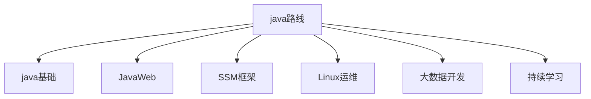

# java学习笔记

## 前言

由于校招进入航旅，技术栈都是java，因此需要从零开始学java，技术路线是先学java基础，然后学springboot。




## 入门环境及环境搭建

### java帝国的诞生

1972年c诞生

- 贴近硬件，运行极快，效率极高。
- 操作系统，编译器，数据库，网络系统等
- 指针和内存管理。

1982年c++诞生

- 面向对象
- 兼容c
- 图形领域，游戏。

建立一个新的语言。

- 语法有点像c
- 没有指针
- 没有内存管理
- 真正可移植性，编写一次，到处运行
- 面向对象
- 类型安全
- 高质量的类库。

1995年网页简单粗糙，缺乏互动。

图形界面的程序（applet）

java2标准版（J2SE）去占领桌面

java2移动版（J2ME）去占领手机

java2企业版（J2EE）去占领服务器

大量巨头加入。

他们基于java开发了很多平台和系统工具。

构建工具：ant,maven,jenkins

应用服务器：tomcat, jetty,jboss,websphere,weblogic

web开发：struts,spriing,hibernate,mybatis

开发工具：eclipse,netbean,intellij idea, jbuilder

2006:hadoop（大数据领域）

2008:android（手机端）

### java特性和优势

简单性、面向对象、可移植性、高性能、分布式、动态性、多线程、安全性、健壮性

### java三大版本

**write once    run anywhere**

**JavaSE:标准版（桌面程序，控制台开发）**

~~javaME:嵌入式开发（手机，小家电）~~

javaEE:企业级开发（web端，服务器开发）

### Jdk jre jvm

JDK:java development kit

JRE:java runtime environment

JVM:java virtual machine

### 安装开发环境

### helloword详解

注意事项：

每个单词的大小写不能出现问题，大小写敏感。

尽量使用英文

文件名和类名必须保持一致。并且首字母大写。

符号使用英文。

### 编译型和解释型

编译型：中文书翻译成英文版，有个负责翻译的程序，complie编译器。.java->.class

类装载器，字节码校验，解释器，操作系统平台。

解释型：中文书一点一点的解释。

### 使用idea开发

## 基础语法学习

### 注释

java注释有三种

单行注释

多行注释

文档注释

### 标识符和关键字

所有的标识符都应以字母，美元符号，或者下划线开头。

**不能用关键字作为变量名或方法名**。

**标识符大小写敏感**。

可以用中文，但尽量不用。

### 数据类型

强类型语言：**要求变量的使用严格符合规定，所有变量都必须先定义后才能使用。**也就是说，一旦一个变量被指定了某个数据类型，如果不经过强制转换，那么它就永远是这个数据类型了。

<!--安全性高，速度慢。-->

弱类型语言：数据类型可以被忽略的语言。它与强类型定义语言相反， 一个变量可以赋不同数据类型的值。

Java的数据类型分为两大类。

基本数据类型

- 数值类型
  - 整数类型
    - byte:-128-127
    - short:-32768-32767
    - int:-2147483648-2147483647
    - Long:-9223372036854775808-9223372036854775807
  - 浮点类型
    - Float 4个字节
    - Double 8个字节
  - 字符类型
    - char 2个字节
- boolean类型

引用数据类型

- 类
- 接口
- 数组

字节：

位（bit）：计算机内部最小的单位，11001100是一个八位二进制数。

字节（byte）：是计算机中数据处理的最小单位，习惯上用大写B来表示。

1B（byte字节）=8bit(位)

1024B=1kb

1024kb=1m

1024m=1G

整数扩展-进制

```
int i=10;
int i2=010;//八进制0
int i3= 0X10;//十六进制0x
```

小数扩展-float

float 有限，离散 舍入误差，大约，接近但不等于

```
float f =0.1f;//0.1
double d =1.0/10;//0.1
System.out.println(f==d);//false
System.out.println(f);
System.out.println(d);
float d1 =232322323232f;
float d2 =d1 +1;
System.out.println(d1==d2);//true
```

**最好避免使用浮点数进行比较**。

字符拓展

```
//字符拓展。
char c1 ='a';
char c2='中';
System.out.println(c1);
System.out.println((int)c1);
System.out.println(c2);
System.out.println((int)c2);
//所有的字符本质还是数字。
```

编码

```
//编码 unicode （97=a  64=A） 2字节， 65536个字符。  excel 2 16  =65536
//U0000 UFFFF
char c3='\u0061';
System.out.println(c3);//a
```

转义字符

```
//转义字符
//  \t 制表符
//  \n 换行   。。。还有更多。
```

布尔值

对象从内存分析

```
String sa=new String("hello world");
String sb =new String("hello world");
System.out.println(sa==sb);//false

String sc ="hello world";
String sd ="hello world";
System.out.println(sc==sd);//true
```

### 类型转换

java是强类型语言，所以运算的时候需要用到类型转换。

低-------->高

Byte,short,char,int,long,float,double

运算中，不同类型的数据先转化为同一类型，然后进行运算。

强制类型转换， 高->低

自动类型转换，低->高

### 变量，常量，作用域

### 基本运算符

### 自增自减运算符

### 三元运算符

### 包机制

### javaDoc生成文档