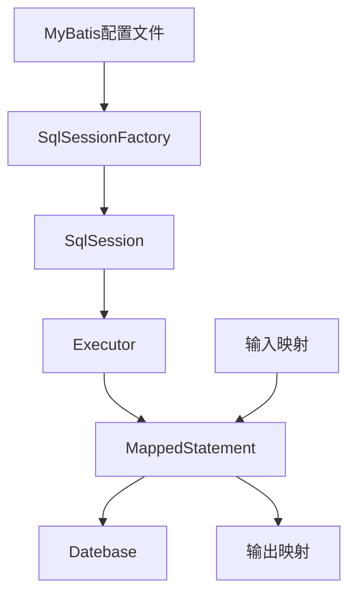

## MyBatis学习笔记

## 三层架构

- 界面层（controller包servlet）：接收用户的数据，渲染显示，和用户打交道。
- 业务逻辑层(service包xxxservice类)：service接收界面层的数据，做业务逻辑，调用数据库
- 数据访问层（dao包xxxdao类）：dao持久层，和数据库打交道。

三层中类的交互

- 用户使用界面层-业务逻辑层-数据访问层（持久层）-数据库（mysql）

三层对应的处理框架

- 界面层-serlet-springmvo 
- 业务逻辑层-service类-spring框架
- 数据访问层-dao类-mybatis框架

框架（模板）-半成品的软件 

- 框架定义好了一些可用的功能
- 可以加入项目中自己的功能，这些功能可以利用框架中写好的功能。


使用jdbc缺陷

- 重复代码多，开发效率低
- 业务代码和数据操作混在一起，增加维护难度
- 需要关注connection等对象的创建和销毁

## mybatis框架

*MyBatis* SQL mapper framework for Java

- sql mapper：sql映射，可以数据库表中的一行数据，映射为一个java对象。操作对象就相当于操作表中的数据。
- data access objects ：daos，数据访问，对数据库执行增删改查。

mybatis提供的功能

- 提供创建和关闭connection，statement，resultset的能力，不用开发人员创建对象
- 提供执行sql语句的能力
- 提供循环sql，把sql的结果转为java对象，list集合的能力。

开发人员做的就是提供sql语句--mybatis处理sql-- 开发人员得到list集合或java对象

总结：mybatis是一个sql映射框架，提供的数据库的操作能力，增强的JDBC，集中精神写sql



## mybatis查询案例

基本步骤

1.加入maven的依赖

```xml
<dependency>
    <groupId>org.mybatis</groupId>
    <artifactId>mybatis</artifactId>
    <version>3.5.1</version>
</dependency>
```

2.创建Dao接口(StudentDao)：定义了你操作数据的方法

```java
package com.dao;
import com.domain.Student;
import java.util.List;
public interface StudentDao {
    //查询所有数据
    public List<Student> selectStudents();
}
```

3.创建mapper文件(StudentDao.xml)，也叫做sql映射文件：写sql语句的，和接口方法中对应的sql语句

```xml
<?xml version="1.0" encoding="UTF-8" ?>
<!DOCTYPE mapper
        PUBLIC "-//mybatis.org//DTD Mapper 3.0//EN"
        "http://mybatis.org/dtd/mybatis-3-mapper.dtd">
<mapper namespace="com.dao.StudentDao">
    <!--
    select：表示查询操作
    id:执行的sql语句的唯一标识，mybatis会使用这个id的值来找到要执行的sql语句，可以自动移，但是要求使用接口中的方法名称。
    resultType：表示结果类型的，是sql语句执行后得到ResulSet,遍历这个ResulSet得到java对象的类型。值写的类型的全限定名称。
    -->
    <select id="selectStudents" resultType="com.domain.Student">
        select id,name,age form Student order by id
    </select>
</mapper>
        <!--
        sql映射文件，写sql语句的，mybatis会执行这些。
        1 指定约束文件
        <!DOCTYPE mapper
                PUBLIC "-//mybatis.org//DTD Mapper 3.0//EN"
                "http://mybatis.org/dtd/mybatis-3-mapper.dtd">
                mybatis-3-mapper.dtd是约束文件的名称，拓展名是.dtd
        2 约束文件的作用：限制，检查在当前文件中出现的标签，属性必须符合mybatis要求。
        3 mapper 是当前文件的根标签，必须的。
            namespace：叫命名空间，唯一值的，可以是自定义的字符串，要求你是用dao接口的全限定名称。

        4 在当前文件中，可以使用特定的标签，表示数据库的特定操作。
        <select>:表示执行查询，select语句
        <update>
        <insert>
        <delete>
        -->
```

4.创建mybatis的一个主配置文件(mybatis.xml)： 1）连接数据库；2）指定mapper文件的位置

```xml
<?xml version="1.0" encoding="UTF-8" ?>
<!DOCTYPE configuration
        PUBLIC "-//mybatis.org//DTD Config 3.0//EN"
        "http://mybatis.org/dtd/mybatis-3-config.dtd">
<configuration>
    <!--环境配置：数据库的链接信息
        default:必须和某个environment的id值一样
        告诉mybatis使用数据库的连接信息
     -->
    <environments default="development">
        <!--environment：一个数据库信息的配置，环境
        id:一个唯一值，自动移，表示环境的名称。
        -->
        <environment id="development">
            <!--
            transactionManager：mybatis的事务类型
            type:JDBC（表示使用jdbc中的connection对象的commit,rollbace做事务处理）
            -->
            <transactionManager type="JDBC"/>
            <!--
            dataSource：表示数据源，链接数据库的
            type:表示数据源的类型，POOLED表示使用连接池
            -->
            <dataSource type="POOLED">
                <!--
                driver，url，username，password是固定的不能自定义。
                -->
                <!--数据库的驱动类名-->
                <property name="driver" value="com.mysql.cj.jdbc.Driver"/>
                <!--连接数据库的url字符串-->
                <property name="url" value="jdbc:mysql://172.24.86.14:3306/USDP?serverTimezone=UTC&amp;userUnicode=true&amp;characterEncoding=utf-8"/>
                <property name="username" value="usdp"/>
                <property name="password" value="usdp_-123"/>
            </dataSource>
        </environment>
    </environments>
    <!--sql mapper（sql映射文件）的位置-->
    <mappers>
        <!--一个mapper标签指定一个文件的位置，从类路径开始的路径信息，target/claess(类路径)-->
        <mapper resource="com/dao/StudentDao.xml"/>
    </mappers>
</configuration>
<!--
mybatis的主配置文件，主要定义了数据库的配置信息，sql映射文件的位置
1。约束文件

<!DOCTYPE configuration
        PUBLIC "-//mybatis.org//DTD Config 3.0//EN"
        "http://mybatis.org/dtd/mybatis-3-config.dtd">
        mybatis-3-config.dtd约束文件的名称
-->
```

5.使用mybatis的对象SqlSession通过他的方法执行sql语句

```java
package com;
import com.domain.Student;
import org.apache.ibatis.io.Resources;
import org.apache.ibatis.session.SqlSession;
import org.apache.ibatis.session.SqlSessionFactory;
import org.apache.ibatis.session.SqlSessionFactoryBuilder;
import java.io.IOException;
import java.io.InputStream;
import java.util.List;
public class MyApp {
    public static void main(String[] args) throws IOException {
        //访问mybatis读取student数据
        //1.定义mubatis主配置文件的名称，从类路径的根开始（target/clasess）
        String config ="mybatis.xml";
        //2.读取这个config表示的文件
        InputStream in = Resources.getResourceAsStream(config);
        //3.创建SqlSessionFactoryBuilderd对象
        SqlSessionFactoryBuilder builder =new SqlSessionFactoryBuilder();
        //4.创建SqlSessionFactory对象
        SqlSessionFactory factory = builder.build(in);
        //5.【重要】获取SqlSession对象，从SqlSessionFactory中获取SqlSession
        SqlSession sqlSession = factory.openSession();
        //6.【重要】指定要执行的sql语句的标识。 sql映射文件中namespace+ "." +标签的id值。
//        String sqlId ="com.dao.StudentDao"+"."+"selectStudents";
        String sqlId ="com.dao.StudentDao.selectStudents";
        //7.执行sql语句，通过sqlId找到语句
        List<Student> studentList= sqlSession.selectList(sqlId);
        //8.输出结果
        studentList.forEach(stu -> System.out.println(stu));
        //9.关闭SqlSession对象
        sqlSession.close();

    }
}
```

所有执行的资源在target中。

如果找不到资源，几种解决办法

- maven clean清除缓存重新compile
- build-Rebuild project
- file-invaildate caches
- 手动copy文件到目录下


## 增加案例

mapper

```java
<insert id="insertStudents">
    insert into Student values(#{id},#{name},#{age})
</insert>
```

test.java

```java
public class TestMybatis {
    public static void main(String[] args) throws IOException {
        //访问mybatis读取student数据
        //1.定义mubatis主配置文件的名称，从类路径的根开始（target/clasess）
        String config ="mybatis.xml";
        //2.读取这个config表示的文件
        InputStream in = Resources.getResourceAsStream(config);
        //3.创建SqlSessionFactoryBuilderd对象
        SqlSessionFactoryBuilder builder =new SqlSessionFactoryBuilder();
        //4.创建SqlSessionFactory对象
        SqlSessionFactory factory = builder.build(in);
        //5.【重要】获取SqlSession对象，从SqlSessionFactory中获取SqlSession
        SqlSession sqlSession = factory.openSession();
        //6.【重要】指定要执行的sql语句的标识。 sql映射文件中namespace+ "." +标签的id值。
//        String sqlId ="com.dao.StudentDao"+"."+"selectStudents";
        String sqlId ="com.dao.StudentDao.insertStudents";
        Student student =new Student();
        student.setId(1003);
        student.setName("张飞");
        student.setAge(20);
        //7.执行sql语句，通过sqlId找到语句
        int nums = sqlSession.insert(sqlId,student);

        //mybatis默认不是自动提交事务的，所以在更新后要手动提交事务
        sqlSession.commit();
        //8.输出
        System.out.println("执行insert结果"+nums);
        //9.关闭SqlSession对象
        sqlSession.close();

    }
}
```

## 配置日志

mybatis.xml

```xml
<!--settings：控制mybatis全局行为-->
    <settings>
        <!--设置mubatis输出日志-->
        <setting name="logImpl" value="STDOUT_LOGGING"/>
    </settings>
```

日志输出结果

Setting autocommit to false on JDBC Connection [com.mysql.cj.jdbc.ConnectionImpl@3eb7fc54]
==>  Preparing: insert into Student values(?,?,?) 
==> Parameters: 1004(Integer), 刘备(String), 30(Integer)
<==    Updates: 1
Committing JDBC Connection [com.mysql.cj.jdbc.ConnectionImpl@3eb7fc54]
执行insert结果1

## 主要类的介绍

- Resources：mybatis中的一个类，负责读取配置

```
InputStream in = Resources.getResourceAsStream(config);
```

- SqlSessionFactoryBuilder创建SqlSessionFactory对象

        //3.创建SqlSessionFactoryBuilderd对象
        SqlSessionFactoryBuilder builde r =new SqlSessionFactoryBuilder();
        //4.创建SqlSessionFactory对象
        SqlSessionFactory factory = builder.build(in);

- SqlSessionFactory：重量级对象，程序创建一个对象耗时长，使用资源多，项目中一个就够
  - SqlSessionFactory接口 接口实现类DefaultSqlSessionFactory
  - SqlSessionFactory作用是获取SqlSession对象         SqlSession sqlSession = factory.openSession();
  - openSession()方法说明
    - openSession无参数的，获取是非自动提交事务的SqlSession对象
    - openSession(boolean): 
      - openSession(true)获取自动提交事务的openSession
      - openSession(false)获取非自动提交事务的openSession
- SqlSession：最终的目的就是获取这个对象，执行增删改查
  - SqlSession接口定义了操作数据的方法，例如selectOne()，selectList()，insert()等
  - SqlSession接口的实现类DefaultSqlSession
  - 使用要求：SqlSession对象不是线程安全的，需要在方法内部使用，在执行sql语句之前，使用openSession()获取SqlSession，在执行完毕后，在把它关闭，这样就能保证线程安全。


为实体类注册别名


## dao

DAO 代表常用的数据库交互的数据访问对象。DAOs 提供一种方法来读取数据并将数据写入到数据库中，它们应该通过一个接口显示此功能，应用程序的其余部分将访问它们。


## mybatis动态代理

在三层架构中，业务逻辑层要通过接口访问数据访问层的功能，动态代理可以实现。

动态代理的实现规范：

1. UserMapper.xml与UserMapper.java的接口必须在同一个目录
2. UserMapper.xml与UserMapper.java的接口的文件名必须一致，后缀不管
3. UserMapper.xml文件中的标签id值与UserMapper.java的接口中方法的名称完全一致
4. UserMapper.xml文件中的标签的parameterType属性值与UserMapper.java的接口中方法的参数类型完全一致
5. UserMapper.xml文件中的标签的resultType值与UserMapper.java的接口中方法的返回类型完全一致
6. UserMapper.xml文件中namespace属性必须是接口的完全限定名称com.mapper.UsersMapper
7. 在SqlMapConfig.xml文件中注册mapper文件时，使用class=接口的完全限定名称com.mapper.UsersMapper

动态代理访问的步骤

1. 建表Users
2. 新建maven工程，刷新可视化
3. 修改目录
4. 修改pom.xml文件
5. 添加jdbc.propertis文件到resources目录下
6. 添加SqlMapConfig.xml文件
7. 添加实体类
8. 添加mapper文件夹，新建UserMapper接口
9. 在mapper文件夹下，新建UsersMapper.xml文件，完成增删改查功能
10. 添加测试类测试功能


动态代理：使用SqlSession.getMapper(dao接口。class)获取这个dao接口的对象

传入参数：从java代码中把数据传入到mapper文件的sql语句中。

- parameterType：写在mapper文件中的一个属性，表示dao接口中方法的参数的数据类型。例如StudentDao接口public Student se;ectStudentById(Integer id)