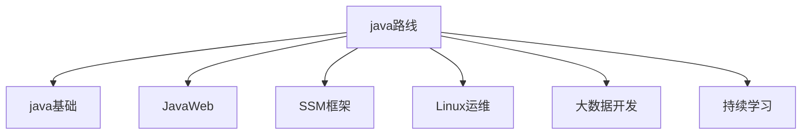
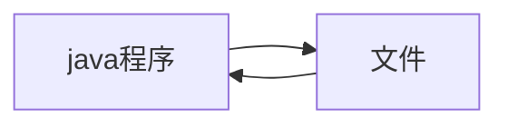

# java学习笔记

# 0.前言

由于校招进入航旅，技术栈都是java，因此需要从零开始学java，技术路线是先学java基础，然后学springboot。



## java入门环境及环境搭建

**java帝国的诞生**

1972年c诞生

- 贴近硬件，运行极快，效率极高。
- 操作系统，编译器，数据库，网络系统等
- 指针和内存管理。

1982年c++诞生

- 面向对象
- 兼容c
- 图形领域，游戏。

建立一个新的语言。

- 语法有点像c
- 没有指针
- 没有内存管理
- 真正可移植性，编写一次，到处运行
- 面向对象
- 类型安全
- 高质量的类库。

1995年网页简单粗糙，缺乏互动。

图形界面的程序（applet）

java2标准版（J2SE）去占领桌面

java2移动版（J2ME）去占领手机

java2企业版（J2EE）去占领服务器

大量巨头加入。

他们基于java开发了很多平台和系统工具。

构建工具：ant,maven,jenkins

应用服务器：tomcat, jetty,jboss,websphere,weblogic

web开发：struts,spring,hibernate,mybatis

开发工具：eclipse,netbean,intellij idea, jbuilder

2006:hadoop（大数据领域）

2008:android（手机端）

**java特性和优势**

简单性、面向对象、可移植性、高性能、分布式、动态性、多线程、安全性、健壮性

**java三大版本**

**write once    run anywhere**

**JavaSE:标准版（桌面程序，控制台开发）**

~~javaME:嵌入式开发（手机，小家电）~~

javaEE:企业级开发（web端，服务器开发）

**Jdk jre jvm**

JDK:java development kit

JRE:java runtime environment

JVM:java virtual machine

**安装开发环境**

MacM1芯片安装java开发环境（idea+jdk）https://www.jianshu.com/p/58f7232eb7ba

∫**编译型和解释**

编译型：中文书翻译成英文版，有个负责翻译的程序，complie编译器。.java->.class

类装载器，字节码校验，解释器，操作系统平台。

解释型：中文书一点一点的解释。

# Java基础语法

一个Java程序可以认为是一系列对象的集合，而这些对象通过调用彼此的方法来协同工作。下面简要介绍下类、对象、方法和实例变量的概念。

- **对象**：对象是类的一个实例，有状态和行为。例如，一条狗是一个对象，它的状态有：颜色、名字、品种；行为有：摇尾巴、叫、吃等。
- **类**：类是一个模板，它描述一类对象的行为和状态。
- **方法**：方法就是行为，一个类可以有很多方法。逻辑运算、数据修改以及所有动作都是在方法中完成的。
- **实例变量**：每个对象都有独特的实例变量，对象的状态由这些实例变量的值决定。

编写Java程序时，应注意以下几点：

- **大小写敏感**：Java是大小写敏感的，这就意味着标识符Hello与hello是不同的。
- **类名**：对于所有的类来说，类名的首字母应该大写。如果类名由若干单词组成，那么每个单词的首字母应该大写，例如 MyFirstJavaClass 。
- **方法名**：所有的方法名都应该以小写字母开头。如果方法名含有若干单词，则后面的每个单词首字母大写。
- **源文件名**：源文件名必须和类名相同。当保存文件的时候，你应该使用类名作为文件名保存（切记Java是大小写敏感的），文件名的后缀为.java。（**如果文件名和类名不相同则会导致编译错误**）。
- **主方法入口**：所有的Java 程序由**`public static void main(String\**[]\** args)`** 方法开始执行。

## 00.helloWord

```java
public class demo00_helloworld {
    //类体
    /*
    public表示公开的
    class表示定义一个类
    helloworld表示一个类名
    */
    public static void main(String[] args) {
        //方法体
        /*
    public表示公开的
    static表示静态的
    void表示空
    main表示方法名是main
    (String[] args)是一个main方法的形式参数列表
    */
        System.out.println("hello,world");

    }
}
```

## 01.对象和类

### **Java修饰符**

像其他语言一样，Java可以使用修饰符来修饰类中方法和属性。主要有两类修饰符：

- 访问控制修饰符 : default, public , protected, private
- 非访问控制修饰符 : final, abstract, static，synchronized 和 volatile

在后面的章节中我们会深入讨论Java修饰符。

### 03.**Java变量类型**

Java中主要有如下几种类型的变量

- 局部变量：类的方法中的变量。
- 类变量（静态变量）：独立于方法之外的变量，用 static 修饰。
- 实例变量：独立于方法之外的变量，不过没有 static 修饰。

### **标识符和关键字**

所有的标识符都应以字母，美元符号，或者下划线开头。

**不能用关键字作为变量名或方法名**。

**标识符大小写敏感**。

可以用中文，但尽量不用。

### 继承

在Java中，一个类可以由其他类派生。如果你要创建一个类，而且已经存在一个类具有你所需要的属性或方法，那么你可以将新创建的类继承该类。

利用继承的方法，可以重用已存在类的方法和属性，而不用重写这些代码。被继承的类称为超类（super class），派生类称为子类（subclass）。

### 接口

在Java中，接口可理解为对象间相互通信的协议。接口在继承中扮演着很重要的角色。

接口只定义派生要用到的方法，但是方法的具体实现完全取决于派生类。

## 02.**基本数据类型**

强类型语言：**要求变量的使用严格符合规定，所有变量都必须先定义后才能使用。**也就是说，一旦一个变量被指定了某个数据类型，如果不经过强制转换，那么它就永远是这个数据类型了。

<!--安全性高，速度慢。-->

弱类型语言：数据类型可以被忽略的语言。它与强类型定义语言相反， 一个变量可以赋不同数据类型的值。

Java的数据类型分为两大类。

基本数据类型

- 数值类型（8种）
  - 整数类型
    - byte:-128-127
    - short:-32768-32767
    - int:-2147483648-2147483647
    - Long:-9223372036854775808-9223372036854775807
  - 浮点类型
    - Float 4个字节
    - Double 8个字节
  - 字符类型
    - char 2个字节
- boolean类型

引用数据类型（所有引用类型的默认值都是null）变量一旦声明后，类型就不能被改变了。

- 类
- 接口
- 数组

一个引用变量可以用来引用与任何与之兼容的类型。

- 例子：Animal animal = new Animal(“giraffe”)。

字节：

位（bit）：计算机内部最小的单位，11001100是一个八位二进制数。

字节（byte）：是计算机中数据处理的最小单位，习惯上用大写B来表示。

1B（byte字节）=8bit(位)

1024B=1kb

1024kb=1m

1024m=1G

整数扩展-进制

```
int i=10;
int i2=010;//八进制0
int i3= 0X10;//十六进制0x
```

小数扩展-float

float 有限，离散 舍入误差，大约，接近但不等于

```
float f =0.1f;//0.1
double d =1.0/10;//0.1
System.out.println(f==d);//false
System.out.println(f);
System.out.println(d);
float d1 =232322323232f;
float d2 =d1 +1;
System.out.println(d1==d2);//true
```

**最好避免使用浮点数进行比较**。

字符拓展

```
//字符拓展。
char c1 ='a';
char c2='中';
System.out.println(c1);
System.out.println((int)c1);
System.out.println(c2);
System.out.println((int)c2);
//所有的字符本质还是数字。
```

编码

```
//编码 unicode （97=a  64=A） 2字节， 65536个字符。  excel 2 16  =65536
//U0000 UFFFF
char c3='\u0061';
System.out.println(c3);//a
```

转义字符

```
//转义字符
//  \t 制表符
//  \n 换行   。。。还有更多。
```

布尔值

对象从内存分析

```
String sa=new String("hello world");
String sb =new String("hello world");
System.out.println(sa==sb);//false

String sc ="hello world";
String sd ="hello world";
System.out.println(sc==sd);//true
```

**数据类型转换**

java是强类型语言，所以运算的时候需要用到类型转换。

低-------->高

Byte,short,char,int,long,float,double

运算中，不同类型的数据先转化为同一类型，然后进行运算。

强制类型转换， 高->低

自动类型转换，低->高

变量，常量，作用域

## 04.java运算符

## 05.循环结构

顺序结构的程序语句只能被执行一次。如果您想要同样的操作执行多次,，就需要使用循环结构。

Java中有三种主要的循环结构：

- while循环
- do…while循环
- for循环

## 06.分支结构

## 07.java数组

声明数组：必须声明数组变量，才能在程序中使用数组

```
double[] myList;//声明数组
```

创建数组

arrayRefVar = new dataType[arraySize];

上面的语法语句做了两件事：

- 一、使用 dataType[arraySize] 创建了一个数组。
- 二、把新创建的数组的引用赋值给变量 arrayRefVar。

数组变量的声明，和创建数组可以用一条语句完成，如下所示：

```
int data[] = new int[3]; /*开辟了一个长度为3的数组*/
data[0] = 10; // 第一个元素
data[1] = 20; // 第二个元素
data[2] = 30; // 第三个元素
double[] myList = {1.9, 2.9, 3.4, 3.5};

```

在Jdk1.5中引入了一种主要用于数组的增强型for循环。

**foreach 循环或者加强型循环（枚举）**,它能在不使用下标的情况下遍历数组。

```java
public class Test {

   public static void main(String args[]){
      int [] numbers = {10, 20, 30, 40, 50};

      for(int x : numbers ){
         System.out.print( x );
         System.out.print(",");
      }
      System.out.print("\n");
      String [] names ={"James", "Larry", "Tom", "Lacy"};
      for( String name : names ) {
         System.out.print( name );
         System.out.print(",");
      }
   }
}
```

数组作为函数的参数

数组可以作为参数传递给方法。例如，下面的例子就是一个打印 int 数组中元素的方法。

```
public static void printArray(int[] array) {
  for (int i = 0; i < array.length; i++) {
     System.out.print(array[i] + " ");
   }
 }
```

数组作为函数的返回值

```
public static int[] reverse(int[] list) {
  int[] result = new int[list.length];
  for (int i = 0, j = result.length - 1; i < list.length; i++, j--) {
     result[j] = list[i];
   }
   return result;
 }
```

java.util.Arrays 类能方便地操作数组，它提供的所有方法都是静态的。具有以下功能：

- 给数组赋值：通过 fill 方法。
- 对数组排序：通过 sort 方法,按升序。
- 比较数组：通过 equals 方法比较数组中元素值是否相等。
- 查找数组元素：通过 binarySearch 方法能对排序好的数组进行二分查找法操作。

## 08.方法

Java方法是语句的集合，它们在一起执行一个功能。

- 方法是解决一类问题的步骤的有序组合
- 方法包含于类或对象中
- 方法在程序中被创建，在其他地方被引用

方法的重载

同名函数，但是参数不同。根据传参的不同来调用同名的不同函数。

如果传递的是double型参数，则double类型的max方法体会被调用，这叫做方法重载；

就是说一个类的两个方法拥有相同的名字，但是有不同的参数列表。

Java编译器根据方法签名判断哪个方法应该被调用。

方法重载可以让程序更清晰易读。执行密切相关任务的方法应该使用相同的名字。

重载的方法必须拥有不同的参数列表。你不能仅仅依据修饰符或者返回类型的不同来重载方法。

## 09.输入

### Scanner类

首先需要构造一个与**标准输入流**System.in关联的Scanner对象。

```java
Scanner sc = new Scanner(System.in); 
```

然后就可以使用Scanner类的各种方法进行读取输入了，例如 **nextLine()**方法将读取一行输入。

```java
String name = sc.nextLine();
```

**Scanner**类位于**java.util**包下，并是一个用**final**修饰的类，实现了**Iterator, Closeable**接口。

next() 不会扫描字符前/后的空格/Tab键，只扫描字符(字符前后不算) ，遇到空格/Tab结束

nextLine() 会扫描字符前/后的空格/Tab键，遇到回车结束

nextInt()将扫描的字符标记为int

单个数据输入（先获取再转化）

基本类型输入

```
Scanner sc = new Scanner(System.in); 

String data = sc.next(); 

int dataInt = Integer.parseInt(data);        

float dataFloat = Float.parseFloat(data);        

short dataShort = Short.parseShort(data);
```

数组类型输入

不定长 以空格，逗号等隔开

```
import java.util.Scanner;

public class InputArrayNoLimitLength {
	public static void main(String[] args) {
	System.out.println("请输入几个数并用逗号隔开:");
	Scanner sc = new Scanner(System.in);//从键盘接收数据
	String str = sc.next().toString();//next()方式接收字符串
	System.out.println(str);
	String[] arr  = str.split(",");
	
	for(int j = 0; j<arr.length;j++) {
		System.out.print(arr[j]+" ");
	}
	}
}

```

定长，给长度

```
import java.util.Scanner;

public class InputArrayLimitLength {
	public static void main(String[] args) {
		Scanner scanner = new Scanner(System.in);
		int n = scanner.nextInt();
		System.out.println("请输入"+n+"个数：");
		Scanner sc = new Scanner(System.in);
		int[] b=new int[n];
		for(int i=0;i<b.length;i++){
			b[i]=sc.nextInt();
			System.out.print(" " + b[i]);
		}
	}
}

```

### 使用命令行相关设置

> DataInputStream din = new DataInputStream(System.in);

和Scanner的用法差不多，下面是它的具体用法，代码如下：

```
public static void main4(String[] args){
        double x = 0, y = 0;
        DataInputStream din = new DataInputStream(System.in);
        try {
            System.out.println("输入x的数值：");
            x = Double.parseDouble(din.readLine());
            System.out.println("输入y的数值：");
            y = Double.parseDouble(din.readLine());
            System.out.println("x的数值：" + x + "; y的数值：" + y);
            System.out.println("x + y = "+ (x+y));
        }catch (Exception e){
            System.out.println("错误！！");
        }
    }
```

### JOptionPane相关功能

这一种输入方法和之前三种输入输出的形式都有所不同，他是会在执行操作的时候，弹出一个弹框，所有的输入输出都需要从弹框中输入显示。

1.显示输入消息框，可以输入数据

```
String str1 = JOptionPane.showInputDialog(“输入消息框”,“0”);
```

2.显示出一个弹框
null表示对话框显示在屏幕中间
第二个参数表示要显示的字符结果

```
JOptionPane.showMessageDialog(null,str1);
JOptionPane.showMessageDialog(null,“a + b =” + c);
```

一个很简单的代码，用来做加减乘除运算：

    public static void main(String[] args) {
        double a,b;
        String str1 = JOptionPane.showInputDialog("输入a的值","0");
         //由于这个方法输入的格式为字符型，所以我们要转换成整型
        a = Integer.parseInt(str1);
        String str2 = JOptionPane.showInputDialog("输入运算符号","+");
        String str3 = JOptionPane.showInputDialog("输入b的值","0");
        b = Integer.parseInt(str3);
        double c = 0;
        if (str2.equals("+") ){
            c = a + b;
        }
        if (str2.equals("-")){
            //或者是str.contains("-")
            c = a - b;
        }
        if (str2.equals("*") ){
            c = a * b;
        }
        if (str2.equals("/") ){
            c = a / b;
        }
        JOptionPane.showMessageDialog(null, c);
    }
## 10.文件操作

文件流



- 流：数据在数据源(文件)和程序(内存)之间经历的路径
- 输入流：数据从数据源(文件)到程序(内存)的路径
- 输出流：数据从程序(内存)到数据源(文件)的路径

### file类

```
new File(String pathname)//根据路径构建一个File对象
new File(File parent,String child)//根据父目录文件+子路径构建
new File(String parent,String child)//根据父目录+子路径构建

//获取文件信息
@Test
public void info() {
    File file = new File("e:\\news1.txt");
    //调用X响应方法，得到相应信息
    System.out.println("文件名字=" + file.getName());
    System.out.println("文件绝对路径=" + file.getAbsolutePath());
    System.out.println("文件父级目录=" + file.getParent());
    System.out.println("文件大小(字节)=" + file.length());
    System.out.println("文件是否存在=" + file.exists());
    System.out.println("是不是一个文件=" + file.isFile());
    System.out.println("是不是一个目录=" + file.isDirectory());
}

```

stream流（字节流）

​	使用FileInputStream类

​	使用FileOutputStream类

stream流（字符流）

​	FileWriter类 与 BufferedWriter类使用

​	FileReader类 与 BufferedReader类使用


> 这段代码我在调试的过程中，犯下了一个致命的错误，就是文件关闭的先后的顺序，我们应该先关闭输入流，然后再关闭文件，我之前是先关闭文件，导致写进去的内容还没保存就关掉了。这里一定要注意！！！

序列化与反序列化

简化成一句话、**序列化**是把Java对象存在一个硬盘，网络，以便传输
也就是把我们的数据永久的存放到计算机当中

FileOutputStream类 以及 ObjectOutputStream类的使用

FileInputStream类 以及 ObjectInputStream类的使用


### ArrayList数组

ArrayList 类是一个可以动态修改的数组，与普通数组的区别就是它是没有固定大小的限制，我们可以添加或删除元素。

使用场景

- 频繁访问列表中的某一个元素。
- 只需要在列表末尾进行添加和删除元素操作

```java
import java.util.ArrayList; // 引入 ArrayList 类
ArrayList<String> sites = new ArrayList<String>();// 初始化
ArrayList<Integer> li=new Arraylist<>();     // 存放整数元素
ArrayList<Character> li=new Arraylist<>();   // 存放字符元素

sites.add("Taobao");//添加元素
System.out.println(sites.get(1));  // 访问第二个元素
sites.set(2, "Wiki"); // 第一个参数为索引位置，第二个为要修改的值
sites.remove(3); // 删除第四个元素
System.out.println(sites.size());//计算大小


```

Collections 类也是一个非常有用的类，位于 java.util 包中，提供的 sort() 方法可以对字符或数字列表进行排序。

```
Collections.sort(sites); *// 字母排序*

**for** (**int** i : myNumbers) {
      System.out.println(i);
    }
```

### LinkedList链表

使用场景

- 你需要通过循环迭代来访问列表中的某些元素。
- 需要频繁的在列表开头、中间、末尾等位置进行添加和删除元素操作。

```java
// 引入 LinkedList 类
import java.util.LinkedList; 

LinkedList<E> list = new LinkedList<E>();   // 普通创建方法
或者
LinkedList<E> list = new LinkedList(Collection<? extends E> c); // 使用集合创建链表

LinkedList<String> sites = new LinkedList<String>();
sites.add("Runoob");
sites.addFirst("Wiki");//使用 addFirst() 在头部添加元素
sites.addLast("Wiki"); // 使用 addLast() 在尾部添加元素
sites.removeFirst();// 使用 removeFirst() 移除头部元素
sites.removeLast();// 使用 removeLast() 移除尾部元素
System.out.println(sites.getFirst()); // 使用 getFirst() 获取头部元素
System.out.println(sites.getLast());// 使用 getLast() 获取尾部元素
//迭代元素
for (int size = sites.size(), i = 0; i < size; i++) {
  System.out.println(sites.get(i));
}
for (String i : sites) {
            System.out.println(i);
        }
```

# java序列化

两个进程进行通信时候，想要发送数据，要先要把数据发送到TCP缓冲区，然后形成报文再发送出去，同样的道理，接收端也是一样。我们可以相互发送各种类型的数据，包括文本、图片、[音频](https://so.csdn.net/so/search?q=音频&spm=1001.2101.3001.7020)、视频等， 而这些数据都会以二进制序列的形式在网络上传送。

一句话：Java序列化是指把Java对象转换为字节序列的过程，而Java反序列化是指把字节序列恢复为Java对象的过程

使用场景：

- 永久性保存对象，保存对的字节序列到本地文件或者数据库中；
- 通过序列化以字节流的形式对象在网络中进行传递和接收；
- 通过序列化在进程间传递对象

序列化的好处：

- 实现了数据的持久化，通过序列化可以把数据永久地保存到硬盘上（持久化对象）
- 利用序列化实现远程通信，即在网络上传送对象的字节序列。（网络传输对象）

Serializable 接口


Externalizable 接口

# 多线程

## 1.线程概述

### 1.1线程的相关概念

**进程**（process）是计算机的程序关于某数据集合的一次运行活动，是操作系统进行资源分配与调度的基本单位。简单理解为操作系统中的运行的一个程序。

**线程**（thread）是进程的一个执行单元，一个线程就是进程中一个单一的控制流，进程的一个执行分支。

进程是线程的容器，一个进程至少有一个线程，一个进程中也可以有多个线程。

在操作系统中是以进程为单位分配资源，如虚拟存储空间，文件描述符等，每个线程都有各自的线程栈，自己的寄存器环境，自己的线程本地存储。

**主线程与子线程**

JVM启动时会创建一个主线程，负责运行main方法的线程。

java中线程不孤立，在A线程中创建B线程，B就是A的子线程，反之是父线程。

串行和并发

串行，先做任务A在做任务B，所有任务逐个完成。

并发，做任务A同时还可以做任务B，任务一起完成。提高事物的处理效率。

并行（并发特例），三个任务同时开始，总耗时取决于时间最长的任务，是更为严格和理想的并发。

从硬件角度来说，如果单核cpu,一个处理器一次只能执行一个线程的情况下，处理器可以使用时间片轮转技术，可以让cpu快速的在各个线程之间切换，对于用户来说感觉是三个线程同时执行。

如果是多核心cpu，可以为不同的线程分配不同的cpu内核。

### 1.2线程的创建与启动

在java中，创建一个线程就是创建一个Thred类（子类）的对象（实例）

### 1.3线程的常用方法

currentThread()方法

Thread.currentThread()可以获得当前线程

Thread.setname()/Thread.getname()设置线程名称/返回线程名称

建议通过设置线程名称，有助于提高程序的可读性。

isAlive()判断当前是否处于活动状态（已启动尚未终止）

sleep()让当前线程休眠毫秒数

Getid()可以获得线程的唯一标识

注意，某个编号的线程运行结束后，该标号可能被后续线程使用。重启jvm后同一个线程的编号可能不一样。

yield()放弃当前的cpu资源

setPriority() 设置线程的优先级。java线程的优先级取值范围为1-10，如果超出这个范围会抛出异常IllegalArgumentException，在操作系统中，优先级较高的线程获得cpu的资源越多，线程优先级本质只是给线程调度器一个提示信息，以便于调度器决定先调用那些线程，注意不能保证优先级高的线程先运行

java优先级设置不当或者滥用可能会导致某些线程永远无法得到运行，即产生了线程饥饿。

线程的优先级并不是设置的越高越好，一般情况喜爱使用普通的优先级即可，在开发是不必设置优先级。

Interrupt()中断线程。

setDaemon()

java中线程分为用户线程和守护线程

守护线程是为其他线程提供服务的线程，如垃圾回收（GC）就是一个典型的守护线程

守护线程不能单独运行，当jvm中没有其他用户线程，只有守护线程时，守护线程会自动销毁，jvm会推出。

### 1.4线程的生命周期

线程的生命周期即为线程的状态。

线程的生命周期可以通过getState()方法获得，线程的状态是Thread.State枚举类型定义的，由以下几种：

new新建状态，创建线程对象，在调用start()启动之前的状态。

runnable可运行状态，复合状态，包含ready和running两个状态，ready状态该线程可以被线程调度器进行调度使他处于running状态，running状态表示该线程正在执行，thread.yield()方法可以把线程running转换为ready状态。

blocked阻塞状态。线程发起阻塞的I/O操作，或者申请由其他线程占用的独占资源，线程会转换为blocked阻塞状态。当阻塞I/O操作执行完，或者线程获得了其申请的资源，线程就可以转换为runnable.

waiting等待状态，线程执行了object.wait(). Thread.join()方法会把线程转换为waiting等待状态，执行object.notify()方法，或者加入的线程执行完毕，当前线程会转换为runnable状态。

timed_waiting状态类似，都是等待状态，区别在于处于该状态的线程不会无限的等待，如果线程没有在指定的时间范围内没有完成操作，该线程自动转换runnable

terminated终止状态，线程结束处于终止状态。

### 1.5多线程编程的优势与风险

优势：

提高系统的吞吐率，多个并发（同时进行的）操作。

提高响应性，web服务器会采用一些专门的线程负责用户的请求处理，缩短用户等待的时间。

充分利用多核处理器资源。

风险：

线程安全问题，如果没有采取正确的并发访问控制措施，可能会产生数据一致性的问题，如读取脏数据，丢失数据更新

线程活性问题。由于程序自身的缺陷或者由资源稀缺性导致线程一直处于非runnable状态，常见活性故障：

- 死锁：鹬蚌相争
- 锁死：睡美人中王子挂了。
- 活锁：小猫咬自己尾巴
- 饥饿：健壮的雏鸟抢母鸟的食物

上下文切换：处理器从执行一个线程切换到执行另外一个线程

可靠性：由一个线程导致JVM意外终止，其他线程也无法执行

# javaJDBC

JDBC（Java DataBase Connectivity）就是Java数据库连接，说白了就是用Java语言来操作数据库。原来我们操作数据库是在控制台使用[SQL语句](https://so.csdn.net/so/search?q=SQL语句&spm=1001.2101.3001.7020)来操作数据库，JDBC是用Java语言向数据库发送SQL语句。

对于数据层的访问，无论是SQL还是NOSQL，spring boot底层都是采用springdata的方式进行统一处理。 JDBC对Java程序员而言是API，对实现与数据库连接的服务提供商而言是接口模型。 

简单地说，JDBC 可做三件事：与数据库建立连接、发送 操作数据库的语句并处理结果。

J：Java：Sun公司提供访问数据库的规范（接口），内容：供程序员调用的接口与类，集成在java.sql和javax.sql包中，如

- 1.DriverManager类 作用：管理各种不同的JDBC驱动
- 2.Connection接口
- 3.Statement接口
- 4.ResultSet接口

DBC：接口的实现，厂商去实现这个接口。

- 提供者：数据库厂商
- 作用：负责连接各种不同的数据库

JDBC

- core：核心包，包含了JDBC的核心功能。例如jdbcTemplate类
- datasource：数据源包
- object：对象包
- support：支持包。是core包和object包的支持类。

针对mysql数据库，有以下四种配置：

1.使用org.springframework.jdbc.datasource.DriverManagerDataSource

使用 DriverManagerDataSource建立连接是只要有连接就新建一个connection,根本没有连接池的作用。

2.使用org.apache.commons.dbcp.BasicDataSource

需要下载的jar包：commons-dbcp.jar，commons-pool.jar
说明:这是一种推荐说明的数据源配置方式，它真正使用了连接池技术

3.spring管理c3p0数据库连接池

注意：这种方法中用了$(username)之后好像会取当前计算机用户名来连接数据库，将db.properties中的username改成user就可以了。

4. 使用hibernate数据源

目前三大框架较流行，spring一般与hiberante做搭档，数据库连接方式写在hiberante的配置文件中，在spring管理hibernate中的配置文件中，直接读取hibernate核心配置文件即可。

## JDBCTemplate

- 即使不使用第三方数据库操作框架，如 MyBatis等，Spring 本身也对原生的JDBC 做了轻量级的封装，即JdbcTemplate。
- 数据库操作的所有 CRUD 方法都在 JdbcTemplate 中。
- Spring Boot 不仅提供了默认的数据源，同时默认已经配置好了 JdbcTemplate 放在了容器中，程序员只需自己注入即可使用
- JdbcTemplate 的自动配置是依赖 org.springframework.boot.autoconfigure.jdbc 包下的 JdbcTemplateConfiguration 类

JdbcTemplate主要提供以下几类方法：

- update（更新数据，即数据的增删改）
- batchUpdate（批量更新数据库）
- queryForObject（查询单行）
- query（查询多行）
- queryForObject（查询单值）

##### 数据库连接池的优点

- 资源重用，避免频繁创建
- 更快的系统反应速度
- 实现某一应用最大可用数据库连接数的限制避免某一应用独占所有资源
- 统一的连接管理，避免数据库连接池链接泄露

